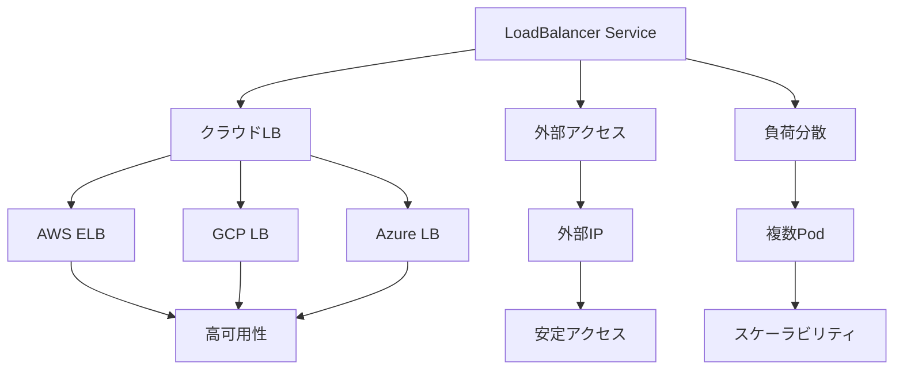

# Kubernetes LoadBalancer Service

## 概要
LoadBalancer ServiceはKubernetesクラスタ内のアプリケーションを外部ネットワークに公開するための重要な仕組みです。

## なぜ必要なのか

### この機能がないとどうなるのか
- 本番環境での高可用性が実現できない
- 外部からの安定したアクセスができない
- クラウド環境での最適なリソース利用ができない

### どのような問題が発生するのか
- システムの可用性が低下する
- 外部アクセスの管理が複雑になる
- クラウドリソースの効率的な利用ができない

### どのようなメリットがあるのか
- 高可用性の実現
- 自動的な負荷分散
- クラウドプロバイダーとの統合

## 重要なポイント

LoadBalancer Serviceの主な特徴は以下の3つです：

1. クラウドプロバイダーのロードバランサーを使用
2. 自動的に外部IPアドレスを割り当て
3. 本番環境での利用に最適化

## 実際の使い方

### 基本的なLoadBalancer Serviceの定義
```yaml
apiVersion: v1
kind: Service
metadata:
  name: my-service
spec:
  selector:
    app: my-app
  ports:
  - port: 80        # Service公開ポート
    targetPort: 8080 # コンテナ側ポート
    protocol: TCP
  type: LoadBalancer
```

### セッション永続性の設定
```yaml
spec:
  sessionAffinity: ClientIP
  sessionAffinityConfig:
    clientIP:
      timeoutSeconds: 10800
```

## 図解による説明



## セキュリティ考慮事項

- 必要最小限のポートのみを公開
- 適切なネットワークポリシーの設定
- アクセス制御の実装
- セキュリティコンテキストの設定
- 定期的なセキュリティ監査

## 参考資料

- [Kubernetes Service公式ドキュメント](https://kubernetes.io/docs/concepts/services-networking/service/)
- [LoadBalancer Service入門](https://thenewstack.io/kubernetes-services-for-beginners/)
- [Kubernetes Serviceチュートリアル](https://www.youtube.com/watch?v=1oPHYtQnwz4)
