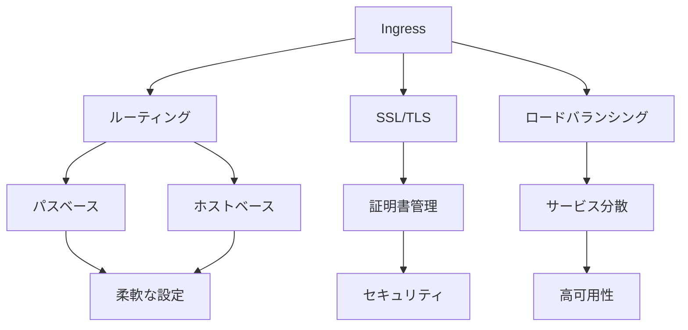

# Kubernetes Ingress

## 概要
Kubernetesにおいて外部からのHTTP/HTTPSトラフィックをクラスター内のサービスにルーティングするためのリソースです。

## なぜ必要なのか

### この機能がないとどうなるのか
- URLベースのルーティングができない
- SSL/TLS終端の一元管理ができない
- 複数サービスへの単一エントリポイントが提供できない

### どのような問題が発生するのか
- サービスごとに個別のロードバランサーが必要
- SSL/TLS証明書の管理が複雑になる
- ルーティングルールの管理が困難になる

### どのようなメリットがあるのか
- 柔軟なルーティングルールの設定
- SSL/TLS終端の一元管理
- 効率的なリソース利用

## 重要なポイント

Ingressの主な特徴は以下の3つです：

1. パスベースのルーティング
2. ホストベースのルーティング
3. TLS/SSL終端

## 実際の使い方

### 基本的なIngressの定義
```yaml
apiVersion: networking.k8s.io/v1
kind: Ingress
metadata:
  name: example-ingress
  annotations:
    nginx.ingress.kubernetes.io/rewrite-target: /
spec:
  rules:
  - host: app.example.com
    http:
      paths:
      - path: /app1
        pathType: Prefix
        backend:
          service:
            name: app1-service
            port:
              number: 80
      - path: /app2
        pathType: Prefix
        backend:
          service:
            name: app2-service
            port:
              number: 80
```

### TLS設定の例
```yaml
apiVersion: networking.k8s.io/v1
kind: Ingress
metadata:
  name: tls-example-ingress
spec:
  tls:
  - hosts:
      - app.example.com
    secretName: example-tls-secret
  rules:
  - host: app.example.com
    http:
      paths:
      - path: /
        pathType: Prefix
        backend:
          service:
            name: app-service
            port:
              number: 80
```

## 図解による説明



## セキュリティ考慮事項

- 適切なTLS/SSL設定
- アクセス制御の実装
- セキュリティコンテキストの設定
- トラフィックの暗号化
- 定期的なセキュリティ監査

## 参考資料

- [Ingress公式ドキュメント](https://kubernetes.io/docs/concepts/services-networking/ingress/)
- [Kubernetes Ingress入門](https://thenewstack.io/kubernetes-ingress-for-beginners/)
- [Kubernetes Ingressチュートリアル](https://www.youtube.com/watch?v=80Ew_fsV4rM)
