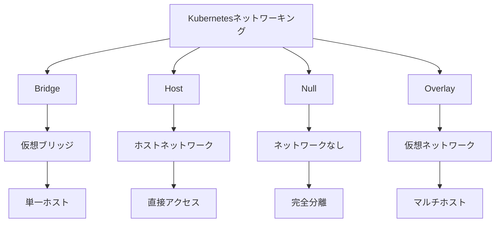

# Kubernetes ネットワーキング: Bridge / Host / Null / Overlay

## 概要
Kubernetesにおけるネットワーキングモデルは、コンテナ間の通信とクラスター内外の接続を実現する重要な基盤です。

## なぜ必要なのか

### この機能がないとどうなるのか
- コンテナ間の通信ができない
- クラスター内外の接続ができない
- ネットワークの分離と管理ができない

### どのような問題が発生するのか
- アプリケーションの連携が困難になる
- セキュリティの確保ができない
- スケーラビリティが制限される

### どのようなメリットがあるのか
- 柔軟なネットワーク設計が可能
- 効率的なリソース利用
- セキュアな通信環境の提供

## 重要なポイント

Kubernetesのネットワークモデルの主な特徴は以下の4つです：

1. Bridge: ホスト上に仮想ブリッジを作成し、コンテナを接続
2. Host: コンテナがホストのネットワーク名前空間を直接使用
3. Null: コンテナにネットワークインターフェースを提供しない
4. Overlay: 物理ネットワーク上に仮想ネットワークレイヤーを構築

## 実際の使い方

### Bridgeネットワークの例
```yaml
apiVersion: v1
kind: Pod
metadata:
  name: bridge-pod
spec:
  containers:
  - name: nginx
    image: nginx
    ports:
    - containerPort: 80
```

### Hostネットワークの例
```yaml
apiVersion: v1
kind: Pod
metadata:
  name: host-pod
spec:
  hostNetwork: true
  containers:
  - name: nginx
    image: nginx
    ports:
    - containerPort: 80
```

## 図解による説明



## セキュリティ考慮事項

- ネットワークポリシーの適切な設定
- コンテナ間通信の制限
- セキュリティコンテキストの設定
- トラフィックの暗号化
- 定期的なセキュリティ監査

## 参考資料

- [クラスターネットワーキング公式ドキュメント](https://kubernetes.io/docs/concepts/cluster-administration/networking/)
- [Kubernetesネットワーキング入門](https://thenewstack.io/kubernetes-networking-for-beginners/)
- [Kubernetesネットワーキングチュートリアル](https://www.youtube.com/watch?v=zWqxXvQnq8E)
