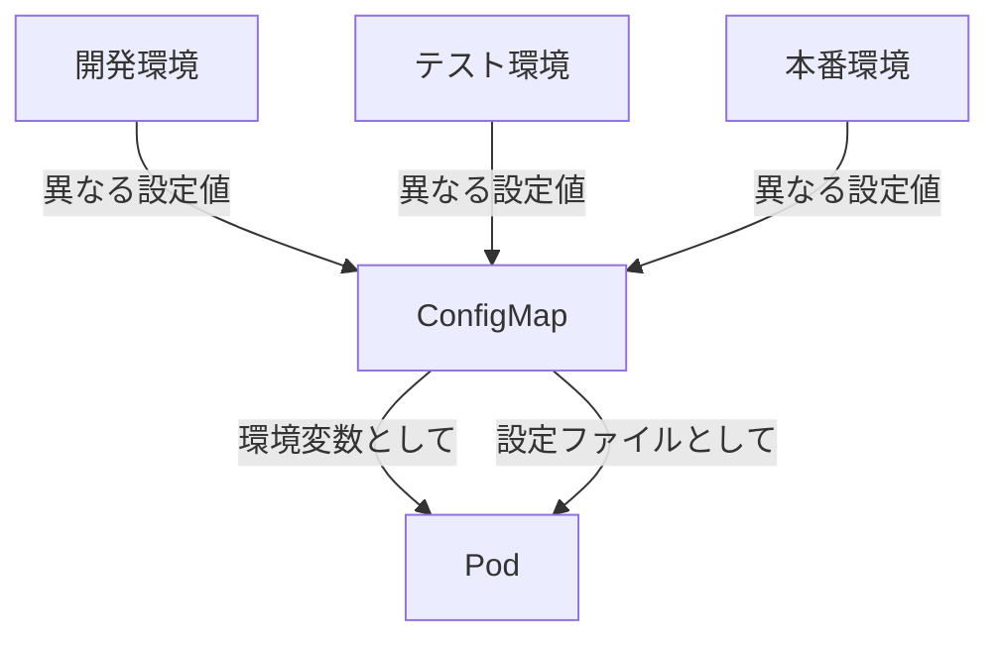

# Kubernetes講義: ConfigMapを使用したPod設定の注入

## 概要
ConfigMapはKubernetesにおいてアプリケーション設定を分離し、環境ごとのデプロイを柔軟に行うための重要なリソースです。

## 1. ConfigMapとは
ConfigMapは、アプリケーションの設定情報をコンテナイメージから分離して管理するためのKubernetesリソースです。

## 2. なぜConfigMapが必要なのか

### ConfigMapがない場合の問題点
- アプリケーションの設定値を変更するたびに、コンテナイメージを再ビルドする必要がある
- 環境ごと（開発・テスト・本番）に異なる設定値を管理できない
- 設定値の変更履歴が追跡できない
- 設定値の共有や再利用が難しい

### ConfigMapを使用するメリット
- アプリケーションコードと設定を分離できる
- 環境ごとに異なる設定値を簡単に管理できる
- 設定変更時にイメージの再ビルドが不要
- 設定データを一元管理できる
- 設定値の変更履歴をGitで管理できる

## 3. 重要なポイント
ConfigMapは、アプリケーションの設定を柔軟に管理し、環境ごとのデプロイを簡単にするための重要な機能です。特に、マイクロサービスアーキテクチャでは、各サービスの設定を個別に管理する必要があり、ConfigMapはその要件を満たすのに最適です。

## 4. 実際の使い方

### ConfigMapの作成
```yaml
apiVersion: v1
kind: ConfigMap
metadata:
  name: app-config
data:
  # 環境変数として使用する設定
  DB_HOST: mysql
  DB_PORT: "3306"
  
  # 設定ファイルとして使用する設定
  config.properties: |
    app.name=MyApp
    app.description=サンプルアプリケーション
    app.log.level=INFO
```

### Podでの利用方法

1. **環境変数として使用**:
```yaml
apiVersion: v1
kind: Pod
metadata:
  name: app-pod
spec:
  containers:
  - name: app-container
    image: myapp:1.0
    env:
    - name: DATABASE_HOST
      valueFrom:
        configMapKeyRef:
          name: app-config
          key: DB_HOST
```

2. **設定ファイルとして使用**:
```yaml
apiVersion: v1
kind: Pod
metadata:
  name: app-pod
spec:
  containers:
  - name: app-container
    image: myapp:1.0
    volumeMounts:
    - name: config-volume
      mountPath: /etc/config
  volumes:
  - name: config-volume
    configMap:
      name: app-config
```

## 5. 図解による説明



この図は、ConfigMapが異なる環境の設定値を管理し、それらをPodに注入する様子を示しています。ConfigMapは環境変数や設定ファイルとしてPodに提供され、アプリケーションはこれらの設定値を使用して動作します。

## セキュリティ上の注意点
- 機密情報（パスワード、APIキーなど）はConfigMapではなく、Secretsを使用する
- ConfigMapのデータは暗号化されないため、機密性の高い情報は含めない
- アクセス制御（RBAC）を適切に設定し、必要なユーザーのみがConfigMapを参照できるようにする

## ベストプラクティス
- 環境ごとに異なるConfigMapを使用する
- 設定値の変更履歴をGitで管理する
- アプリケーションの機能別にConfigMapを分割する
- デフォルト値をアプリケーション内に持ち、ConfigMapが存在しない場合のフォールバック処理を実装する
- 設定値の変更を監視し、必要に応じてPodを再起動する仕組みを実装する

## まとめ

ConfigMapを使用することで、アプリケーションコードから設定を分離し、環境ごとに異なる設定を簡単に管理できるようになります。環境変数やファイルとしてPodに注入することができ、柔軟なアプリケーション設定管理を実現します。
