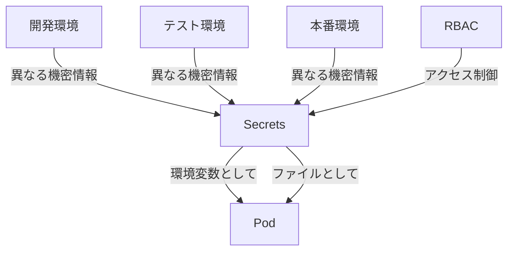

# 機密データ用のSecretsの使用

## 1. Secretsとは
Secretsは、パスワードやトークン、APIキーなどの機密データを安全に管理するためのKubernetesリソースです。

## 2. なぜSecretsが必要なのか

### Secretsがない場合の問題点
- 機密情報がコンテナイメージや設定ファイルに平文で保存される
- 機密情報の変更時にイメージの再ビルドが必要
- 環境ごとの機密情報管理が困難
- アクセス制御が不十分
- セキュリティリスクが高まる

### Secretsを使用するメリット
- 機密情報を安全に管理できる
- 環境ごとに異なる機密情報を簡単に管理できる
- アクセス制御（RBAC）で権限管理が可能
- 機密情報の変更時にイメージの再ビルドが不要
- 機密情報の一元管理が可能

## 3. 重要なポイント
Secretsは、アプリケーションの機密情報を安全に管理し、セキュアなアプリケーション構築を実現するための重要な機能です。特に、マイクロサービスアーキテクチャでは、各サービスが異なる機密情報を必要とするため、Secretsはその要件を満たすのに最適です。

## 4. 実際の使い方

### Secretsの作成
```yaml
apiVersion: v1
kind: Secret
metadata:
  name: db-credentials
type: Opaque
data:
  # Base64エンコードされた値
  username: YWRtaW4=  # "admin"
  password: cGFzc3dvcmQxMjM=  # "password123"
```

### Podでの利用方法

1. **環境変数として使用**:
```yaml
apiVersion: v1
kind: Pod
metadata:
  name: app-pod
spec:
  containers:
  - name: app-container
    image: my-app:1.0
    env:
    - name: DB_USERNAME
      valueFrom:
        secretKeyRef:
          name: db-credentials
          key: username
    - name: DB_PASSWORD
      valueFrom:
        secretKeyRef:
          name: db-credentials
          key: password
```

2. **ファイルとして使用**:
```yaml
apiVersion: v1
kind: Pod
metadata:
  name: app-pod
spec:
  containers:
  - name: app-container
    image: my-app:1.0
    volumeMounts:
    - name: secrets-volume
      mountPath: /etc/secrets
      readOnly: true
  volumes:
  - name: secrets-volume
    secret:
      secretName: db-credentials
```

## 5. 図解による説明



この図は、Secretsが異なる環境の機密情報を管理し、それらをPodに安全に提供する様子を示しています。また、RBACによるアクセス制御も表現しています。

## セキュリティ上の注意点
- SecretsはデフォルトではBase64エンコードのみで、暗号化されていない
- etcdの暗号化を必ず有効にする
- アクセス制御（RBAC）を適切に設定する
- 機密情報の定期的なローテーションを実施する
- より高度なセキュリティが必要な場合は、HashiCorp Vaultなどの外部シークレット管理ツールの使用を検討する

## ベストプラクティス
- 環境ごとに異なるSecretsを使用する
- 最小権限の原則に基づいてアクセス制御を設定する
- 機密情報の変更履歴を管理する
- 定期的な機密情報のローテーションを実施する
- 機密情報の漏洩を防ぐため、ログや監査ログを適切に設定する
- イメージやGitリポジトリに機密情報を含めない
