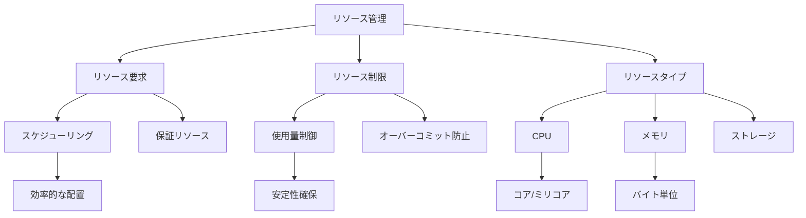

# リソース要求と制限の設定

Kubernetesでは、コンテナの実行に必要なCPUとメモリの最小値（要求）と最大値（制限）を指定できます。リソース要求はコンテナのスケジューリングに使用され、制限はリソースの使用量を制御します。これらの設定は、クラスター内のリソースを効率的に利用するために重要です。

## 主要概念

リソース管理の基本要素：

1. リソース要求（Requests）
   - コンテナの実行に必要な最小リソース量
   - スケジューリングの基準
   - 保証されるリソース量

2. リソース制限（Limits）
   - コンテナが使用できる最大リソース量
   - リソース使用量の制御
   - オーバーコミットの防止

3. リソースタイプ
   - CPU（コア数またはミリコア）
   - メモリ（バイト単位）
   - 一時ストレージ
   - 拡張リソース

## 実装例

### 基本的なリソース設定

```yaml
apiVersion: v1
kind: Pod
metadata:
  name: frontend
spec:
  containers:
  - name: app
    image: nginx
    resources:
      requests:
        memory: "64Mi"
        cpu: "250m"
      limits:
        memory: "128Mi"
        cpu: "500m"
```

### 複数コンテナのリソース設定

```yaml
apiVersion: v1
kind: Pod
metadata:
  name: multi-container
spec:
  containers:
  - name: main
    image: nginx
    resources:
      requests:
        memory: "128Mi"
        cpu: "500m"
      limits:
        memory: "256Mi"
        cpu: "1000m"
  - name: sidecar
    image: busybox
    resources:
      requests:
        memory: "32Mi"
        cpu: "100m"
      limits:
        memory: "64Mi"
        cpu: "200m"
```

## リソース管理の特徴



## セキュリティ考慮事項

- 適切なリソース制限の設定
- ノードのリソース容量の監視
- リソース使用量の監視とアラート
- クォータの設定と管理
- リソースの枯渇対策

## 主なユースケース

1. 本番環境
   - 安定したリソース割り当て
   - パフォーマンスの保証
   - コスト管理

2. 開発環境
   - 柔軟なリソース設定
   - 効率的なリソース利用
   - 開発効率の向上

3. マルチテナント環境
   - テナント間の分離
   - 公平なリソース配分
   - リソースの制限と管理

## トラブルシューティング

1. スケジューリング失敗
   - リソース要求が大きすぎる
   - ノードのリソース不足
   - 不適切なリソース設定

2. コンテナの終了
   - メモリ制限超過（OOMKilled）
   - CPU制限超過
   - リソースの枯渇

## 参考資料

- [リソース要求と制限の公式ドキュメント](https://kubernetes.io/docs/concepts/configuration/manage-resources-containers/#requests-and-limits)
- [デフォルトメモリ制限と要求の動機](https://kubernetes.io/docs/tasks/administer-cluster/manage-resources/memory-default-namespace/#motivation-for-default-memory-limits-and-requests)
- [Kubernetesリソースタイプの理解](https://thenewstack.io/understanding-kubernetes-resource-types/)
- [Kubernetesのリソース要求と制限の解説](https://thenewstack.io/kubernetes-requests-and-limits-demystified/)
