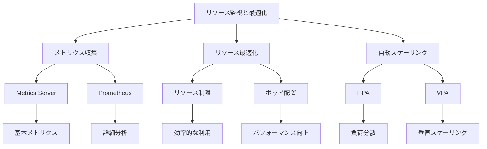

# リソース使用状況の監視と最適化

Kubernetesクラスター内のリソース使用状況を監視し最適化することは、効率的なリソース利用とアプリケーションの安定性を確保するために重要です。Metrics ServerやPrometheusなどのツールを使用して監視を行い、適切なリソース設定と自動スケーリングによって最適化を実現します。

## 主要概念

リソース監視と最適化の基本要素：

1. リソースメトリクスパイプライン
   - Metrics Serverによる基本的なメトリクス収集
   - CPUとメモリ使用量の監視
   - ノードとポッドのリソース使用状況

2. フルメトリクスパイプライン
   - Prometheusなどの監視ツール
   - カスタムメトリクスの収集
   - 詳細な分析と可視化

3. 最適化手法
   - 水平ポッド自動スケーリング（HPA）
   - ポッドのアフィニティルール
   - ノード選択の制御

## 実装例

### Metrics Serverの設定

```yaml
apiVersion: v1
kind: ServiceAccount
metadata:
  name: metrics-server
  namespace: kube-system
---
apiVersion: apps/v1
kind: Deployment
metadata:
  name: metrics-server
  namespace: kube-system
spec:
  selector:
    matchLabels:
      k8s-app: metrics-server
  template:
    metadata:
      labels:
        k8s-app: metrics-server
    spec:
      serviceAccountName: metrics-server
      containers:
      - name: metrics-server
        image: k8s.gcr.io/metrics-server/metrics-server:v0.6.1
        args:
        - --kubelet-insecure-tls
        - --kubelet-preferred-address-types=InternalIP
```

### 水平ポッド自動スケーリングの設定

```yaml
apiVersion: autoscaling/v2
kind: HorizontalPodAutoscaler
metadata:
  name: myapp-hpa
spec:
  scaleTargetRef:
    apiVersion: apps/v1
    kind: Deployment
    name: myapp
  minReplicas: 1
  maxReplicas: 10
  metrics:
  - type: Resource
    resource:
      name: cpu
      target:
        type: Utilization
        averageUtilization: 80
```

## リソース監視と最適化の特徴



## セキュリティ考慮事項

- メトリクスエンドポイントの保護
- 監視データの暗号化
- アクセス制御の設定
- アラートの適切な設定
- 監視システムの分離

## 主なユースケース

1. 本番環境の監視
   - リソース使用率の追跡
   - パフォーマンスの最適化
   - コスト管理

2. 開発環境の最適化
   - リソース使用効率の向上
   - 開発サイクルの短縮
   - テスト環境の効率化

3. マルチテナント環境
   - テナント間のリソース分離
   - 公平なリソース配分
   - 使用量の監視と制御

## 最適化のベストプラクティス

1. リソース要求と制限の適切な設定
   - 実際の使用量に基づく設定
   - バッファの考慮
   - 定期的な見直し

2. 自動スケーリングの活用
   - HPAの適切な設定
   - メトリクスの選択
   - スケーリングポリシーの最適化

3. ポッドの配置最適化
   - アフィニティルールの設定
   - ノード選択の制御
   - リソースの分散

## 参考資料

- [リソース監視ツールの公式ドキュメント](https://kubernetes.io/docs/tasks/debug/debug-cluster/resource-usage-monitoring/)
- [Kubernetesリソース最適化の基本](https://sequoia.makes.software/kubernetes-resource-optimization-just-the-basics/)
- [適切なKubernetes監視ツールの選択方法](https://thenewstack.io/how-to-choose-the-right-kubernetes-monitoring-tool/)
- [モニタリングに関する最新情報](https://app.daily.dev/tags/monitoring?ref=roadmapsh)
