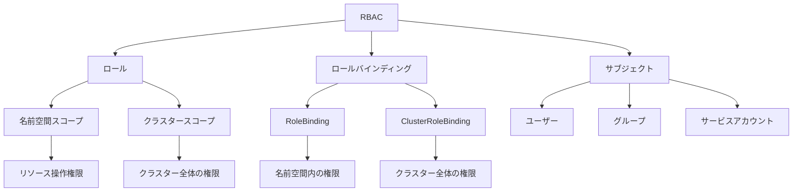

# ロールベースアクセス制御（RBAC）

Kubernetesのロールベースアクセス制御（RBAC）は、ユーザーやグループに割り当てられたロールに基づいて、クラスターリソースへのアクセスを制御する仕組みです。RBACを使用することで、セキュリティを確保しながら、適切なアクセス権限を付与することができます。

## 主要概念

RBACの基本要素：

1. ロール（Role/ClusterRole）
   - リソースに対する操作権限の定義
   - 名前空間スコープ（Role）とクラスタースコープ（ClusterRole）
   - 権限の粒度の制御

2. ロールバインディング（RoleBinding/ClusterRoleBinding）
   - ロールとユーザー/グループの紐付け
   - 名前空間スコープ（RoleBinding）とクラスタースコープ（ClusterRoleBinding）
   - アクセス権限の適用範囲の制御

3. サブジェクト（Subject）
   - ユーザー（User）
   - グループ（Group）
   - サービスアカウント（ServiceAccount）

## 実装例

### 基本的なロールの定義

```yaml
apiVersion: rbac.authorization.k8s.io/v1
kind: Role
metadata:
  namespace: default
  name: pod-reader
rules:
- apiGroups: [""]
  resources: ["pods"]
  verbs: ["get", "watch", "list"]
```

### ロールバインディングの設定

```yaml
apiVersion: rbac.authorization.k8s.io/v1
kind: RoleBinding
metadata:
  name: read-pods
  namespace: default
subjects:
- kind: User
  name: jane
  apiGroup: rbac.authorization.k8s.io
roleRef:
  kind: Role
  name: pod-reader
  apiGroup: rbac.authorization.k8s.io
```

### クラスターロールの定義

```yaml
apiVersion: rbac.authorization.k8s.io/v1
kind: ClusterRole
metadata:
  name: secret-reader
rules:
- apiGroups: [""]
  resources: ["secrets"]
  verbs: ["get", "watch", "list"]
```

## RBACの特徴



## セキュリティ考慮事項

- 最小権限の原則の適用
- 特権的なトークンの配布の最小化
- 定期的な権限の見直し
- 名前空間の適切な分離
- サービスアカウントの適切な管理

## 主なユースケース

1. 開発環境
   - 開発者への適切な権限付与
   - テスト環境の分離
   - デバッグ権限の制御

2. 本番環境
   - 運用チームへの権限付与
   - 監査ログの取得
   - セキュリティポリシーの適用

3. マルチテナント環境
   - テナント間の分離
   - リソースアクセスの制御
   - コンプライアンス要件の対応

## ベストプラクティス

1. 権限の最小化
   - 必要最小限の権限のみを付与
   - ワイルドカードの使用を避ける
   - 定期的な権限の見直し

2. 名前空間の活用
   - 適切な名前空間の分離
   - 名前空間レベルの権限設定
   - リソースの論理的な分離

3. 監査とコンプライアンス
   - アクセスログの取得
   - 定期的なセキュリティ監査
   - コンプライアンス要件への対応

## 参考資料

- [RBACのベストプラクティス公式ドキュメント](https://kubernetes.io/docs/concepts/security/rbac-good-practices/)
- [Kubernetesアクセス制御の基礎](https://thenewstack.io/a-primer-on-kubernetes-access-control/)
- [Kubernetes認可の実践的な理解](https://thenewstack.io/a-practical-approach-to-understanding-kubernetes-authorization/)
- [Kubernetes RBACの3つの現実的なアプローチ](https://thenewstack.io/three-realistic-approaches-to-kubernetes-rbac/)
- [ロールベースアクセス制御：5つの一般的な認可パターン](https://thenewstack.io/role-based-access-control-five-common-authorization-patterns/)
- [RBACを使用したKubernetesの大規模セキュリティ](https://thenewstack.io/securing-kubernetes-and-other-resources-at-scale-using-rbac/)
- [KubernetesのRBACを理解する](https://www.youtube.com/watch?v=G3R24JSlGjY)
