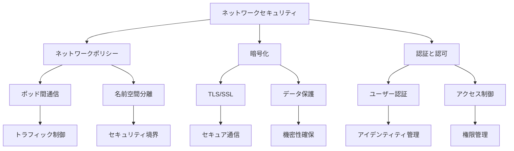

# ネットワークセキュリティ

Kubernetesクラスター内のネットワークセキュリティは、コンポーネント間の通信と外部ネットワークとの接続を保護するために重要です。Network Policies、暗号化、認証、認可などの仕組みを使用して、クラスターの機密性、完全性、可用性を維持します。

## なぜ必要なのか

### ネットワークセキュリティがない場合の問題点
- コンポーネント間の通信が無制限で、セキュリティリスクが高い
- 不正アクセスやデータ漏洩の危険性
- ネットワーク攻撃に対する脆弱性
- コンプライアンス要件への対応が困難

### ネットワークセキュリティを導入するメリット
- コンポーネント間の通信の制御と保護
- 不正アクセスの防止
- データの機密性と完全性の確保
- コンプライアンス要件への対応が容易

## 重要なポイント

ネットワークセキュリティは、クラスター内の通信を保護し、不正アクセスを防ぐために重要です。適切なセキュリティ設定により、クラスターの安全性を確保し、データの保護を実現することができます。

## 実装例

### 基本的なネットワークポリシー

```yaml
apiVersion: networking.k8s.io/v1
kind: NetworkPolicy
metadata:
  name: test-network-policy
  namespace: default
spec:
  podSelector:
    matchLabels:
      role: db
  policyTypes:
  - Ingress
  - Egress
  ingress:
  - from:
    - podSelector:
        matchLabels:
          role: frontend
    ports:
    - protocol: TCP
      port: 6379
```

### 複数の名前空間を対象としたネットワークポリシー

```yaml
apiVersion: networking.k8s.io/v1
kind: NetworkPolicy
metadata:
  name: egress-namespaces
spec:
  podSelector:
    matchLabels:
      app: myapp
  policyTypes:
  - Egress
  egress:
  - to:
    - namespaceSelector:
        matchExpressions:
        - key: namespace
          operator: In
          values: ["frontend", "backend"]
```

### ポート範囲を指定したネットワークポリシー

```yaml
apiVersion: networking.k8s.io/v1
kind: NetworkPolicy
metadata:
  name: multi-port-egress
  namespace: default
spec:
  podSelector:
    matchLabels:
      role: db
  policyTypes:
    - Egress
  egress:
    - to:
        - ipBlock:
            cidr: 10.0.0.0/24
      ports:
        - protocol: TCP
          port: 32000
          endPort: 32768
```

## ネットワークセキュリティの仕組み



## セキュリティ考慮事項

- 最小権限の原則の適用
- ネットワークポリシーの適切な設定
- 暗号化の強制と証明書の管理
- 定期的なセキュリティ監査
- インシデント対応計画の策定

## 参考資料

- [ネットワークポリシーの公式ドキュメント](https://kubernetes.io/docs/concepts/services-networking/network-policies/)
- [6つのKubernetesセキュリティベストプラクティス](https://thenewstack.io/6-kubernetes-security-best-practices/)
- [Kubernetesネットワークセキュリティの効果](https://thenewstack.io/the-kubernetes-network-security-effect/)
