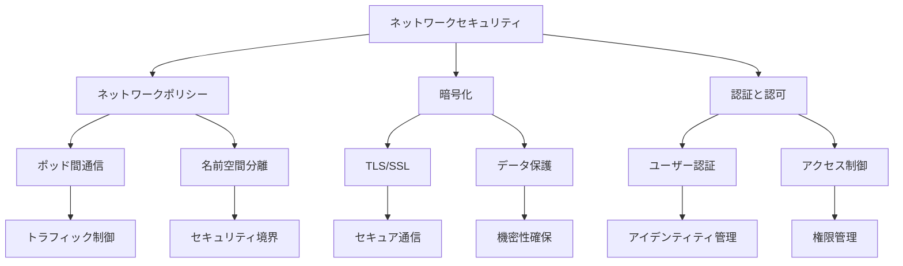

# ネットワークセキュリティ

Kubernetesクラスター内のネットワークセキュリティは、コンポーネント間の通信と外部ネットワークとの接続を保護するために重要です。Network Policies、暗号化、認証、認可、ファイアウォールルールなどの仕組みを使用して、クラスターの機密性、完全性、可用性を維持します。

## 主要概念

ネットワークセキュリティの基本要素：

1. ネットワークポリシー
   - ポッド間の通信制御
   - 名前空間レベルの分離
   - トラフィックフィルタリング

2. 暗号化
   - 通信の暗号化（TLS/SSL）
   - データの保護
   - セキュアな通信チャネル

3. 認証と認可
   - ユーザー認証
   - サービスアカウントの管理
   - アクセス制御

## 実装例

### 基本的なネットワークポリシー

```yaml
apiVersion: networking.k8s.io/v1
kind: NetworkPolicy
metadata:
  name: test-network-policy
  namespace: default
spec:
  podSelector:
    matchLabels:
      role: db
  policyTypes:
  - Ingress
  - Egress
  ingress:
  - from:
    - podSelector:
        matchLabels:
          role: frontend
    ports:
    - protocol: TCP
      port: 6379
```

### 複数の名前空間を対象としたネットワークポリシー

```yaml
apiVersion: networking.k8s.io/v1
kind: NetworkPolicy
metadata:
  name: egress-namespaces
spec:
  podSelector:
    matchLabels:
      app: myapp
  policyTypes:
  - Egress
  egress:
  - to:
    - namespaceSelector:
        matchExpressions:
        - key: namespace
          operator: In
          values: ["frontend", "backend"]
```

### ポート範囲を指定したネットワークポリシー

```yaml
apiVersion: networking.k8s.io/v1
kind: NetworkPolicy
metadata:
  name: multi-port-egress
  namespace: default
spec:
  podSelector:
    matchLabels:
      role: db
  policyTypes:
    - Egress
  egress:
    - to:
        - ipBlock:
            cidr: 10.0.0.0/24
      ports:
        - protocol: TCP
          port: 32000
          endPort: 32768
```

## ネットワークセキュリティの特徴



## セキュリティ考慮事項

- 最小権限の原則の適用
- ネットワークポリシーの適切な設定
- 暗号化の強制
- 定期的なセキュリティ監査
- インシデント対応計画の策定

## 主なユースケース

1. マルチテナント環境
   - テナント間の分離
   - リソースの保護
   - コンプライアンス要件の対応

2. 本番環境
   - セキュアな通信
   - アクセス制御
   - 監査ログの取得

3. 開発環境
   - 開発者アクセスの制御
   - テスト環境の分離
   - セキュリティテストの実施

## ベストプラクティス

1. ネットワークポリシーの実装
   - デフォルトの拒否ポリシー
   - 必要最小限の許可ルール
   - 定期的なポリシーの見直し

2. 暗号化の適用
   - TLS/SSLの強制
   - 証明書の適切な管理
   - 暗号化アルゴリズムの選択

3. 監視とログ記録
   - ネットワークトラフィックの監視
   - セキュリティイベントのログ記録
   - 異常検知の実装

## 制限事項

現在のNetworkPolicy APIでは以下の機能は実装されていません：

- 内部クラスタートラフィックの共通ゲートウェイ強制
- TLS関連の機能
- ノード固有のポリシー
- サービス名によるターゲティング
- デフォルトポリシーの適用
- ネットワークセキュリティイベントのログ記録
- 明示的な拒否ポリシー
- ループバックやホストトラフィックの防止

## 参考資料

- [ネットワークポリシーの公式ドキュメント](https://kubernetes.io/docs/concepts/services-networking/network-policies/)
- [6つのKubernetesセキュリティベストプラクティス](https://thenewstack.io/6-kubernetes-security-best-practices/)
- [Kubernetesネットワークセキュリティの効果](https://thenewstack.io/the-kubernetes-network-security-effect/)
- [Kubernetesセキュリティベストプラクティス](https://thenewstack.io/kubernetes-security-best-practices-to-keep-you-out-of-the-news/)
- [Kubernetesセキュリティベストプラクティス（動画）](https://www.youtube.com/watch?v=oBf5lrmquYI)
- [セキュリティに関する最新情報](https://app.daily.dev/tags/security?ref=roadmapsh)
