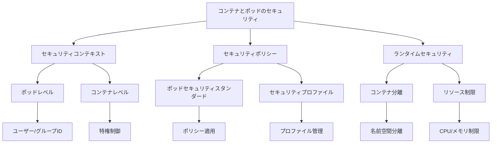

# コンテナとポッドのセキュリティ

Kubernetesクラスターのセキュリティを確保するためには、コンテナとポッドのレベルでの適切なセキュリティ設定が重要です。信頼できるコンテナイメージの使用、コンテナの特権制限、ポッドレベルのセキュリティポリシーの適用、ネットワークセキュリティ対策、RBACによるアクセス制御、SecretsやConfigMapsによる機密情報の管理など、多層的なアプローチが必要です。

## 主要概念

コンテナとポッドのセキュリティの基本要素：

1. セキュリティコンテキスト
   - ポッドレベルの設定
   - コンテナレベルの設定
   - 特権と権限の制御

2. セキュリティポリシー
   - ポッドセキュリティスタンダード
   - ポッドセキュリティアドミッション
   - セキュリティプロファイル

3. コンテナランタイムセキュリティ
   - コンテナの分離
   - リソース制限
   - システムコールの制限

## 実装例

### ポッドのセキュリティコンテキスト設定

```yaml
apiVersion: v1
kind: Pod
metadata:
  name: security-context-demo
spec:
  securityContext:
    runAsUser: 1000
    runAsGroup: 3000
    fsGroup: 2000
  volumes:
  - name: sec-ctx-vol
    emptyDir: {}
  containers:
  - name: sec-ctx-demo
    image: busybox
    command: ["sh", "-c", "sleep 1h"]
    volumeMounts:
    - name: sec-ctx-vol
      mountPath: /data/demo
    securityContext:
      allowPrivilegeEscalation: false
      capabilities:
        drop: ["ALL"]
```

### コンテナのセキュリティコンテキスト設定

```yaml
apiVersion: v1
kind: Pod
metadata:
  name: security-context-demo-2
spec:
  containers:
  - name: sec-ctx-demo-2
    image: gcr.io/google-samples/node-hello:1.0
    securityContext:
      runAsUser: 1000
      runAsGroup: 3000
      allowPrivilegeEscalation: false
      capabilities:
        add: ["NET_ADMIN", "SYS_TIME"]
```

### SELinuxラベルの設定

```yaml
apiVersion: v1
kind: Pod
metadata:
  name: security-context-demo-3
spec:
  containers:
  - name: sec-ctx-demo-3
    image: busybox
    command: ["sh", "-c", "sleep 1h"]
    securityContext:
      seLinuxOptions:
        level: "s0:c123,c456"
```

## セキュリティの特徴



## セキュリティ考慮事項

- 最小権限の原則の適用
- コンテナの特権の最小化
- セキュリティコンテキストの適切な設定
- 定期的なセキュリティ監査
- 脆弱性スキャンの実施

## 主なユースケース

1. 本番環境
   - セキュアなコンテナ実行
   - リソース制限の適用
   - セキュリティポリシーの強制

2. 開発環境
   - 開発者アクセスの制御
   - テスト環境の分離
   - セキュリティテストの実施

3. マルチテナント環境
   - テナント間の分離
   - リソースの保護
   - コンプライアンス要件の対応

## ベストプラクティス

1. セキュリティコンテキストの設定
   - 非rootユーザーの使用
   - 特権の最小化
   - 適切な権限の設定

2. コンテナイメージの管理
   - 信頼できるイメージの使用
   - 定期的な更新
   - 脆弱性スキャン

3. セキュリティポリシーの適用
   - ポッドセキュリティスタンダードの使用
   - セキュリティプロファイルの設定
   - ポリシーの定期的な見直し

## 制限事項

- 一部のセキュリティ機能は特定のコンテナランタイムに依存
- セキュリティポリシーの適用には追加の設定が必要
- パフォーマンスへの影響を考慮する必要がある

## 参考資料

- [ポッドとコンテナのセキュリティコンテキスト設定](https://kubernetes.io/docs/tasks/configure-pod-container/security-context/)
- [Kubernetesポッドセキュリティポリシーの作成チュートリアル](https://thenewstack.io/tutorial-create-a-kubernetes-pod-security-policy/)
- [見落とされがちな6つの重要なKubernetesセキュリティ機能](https://thenewstack.io/6-overlooked-yet-important-kubernetes-features-to-secure/)
- [Kubernetesセキュリティ - ポッドとコンテナのセキュリティコンテキスト（動画）](https://www.youtube.com/watch?v=i8wfvoVf2xs)
- [セキュリティに関する最新情報](https://app.daily.dev/tags/security?ref=roadmapsh)
