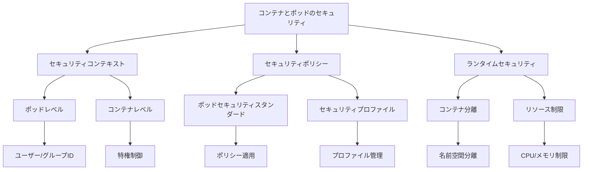

# コンテナとポッドのセキュリティ

Kubernetesクラスターのセキュリティを確保するためには、コンテナとポッドのレベルでの適切なセキュリティ設定が重要です。信頼できるコンテナイメージの使用、コンテナの特権制限、ポッドレベルのセキュリティポリシーの適用など、多層的なアプローチが必要です。

## なぜ必要なのか

### セキュリティ設定がない場合の問題点
- コンテナが過剰な特権を持ち、セキュリティリスクが高い
- 脆弱なコンテナイメージの使用による攻撃の危険性
- ポッド間の分離が不十分で、横方向の攻撃が可能
- コンプライアンス要件への対応が困難

### セキュリティ設定を導入するメリット
- コンテナの特権を最小限に抑え、セキュリティリスクを低減
- 信頼できるコンテナイメージの使用による攻撃の防止
- ポッド間の適切な分離による横方向の攻撃の防止
- コンプライアンス要件への対応が容易

## 重要なポイント

コンテナとポッドのセキュリティは、クラスター全体のセキュリティを確保するために重要です。最小権限の原則に基づいて、必要な権限のみを付与することで、セキュリティリスクを最小限に抑えることができます。

## 実装例

### ポッドのセキュリティコンテキスト設定

```yaml
apiVersion: v1
kind: Pod
metadata:
  name: security-context-demo
spec:
  securityContext:
    runAsUser: 1000
    runAsGroup: 3000
    fsGroup: 2000
  volumes:
  - name: sec-ctx-vol
    emptyDir: {}
  containers:
  - name: sec-ctx-demo
    image: busybox
    command: ["sh", "-c", "sleep 1h"]
    volumeMounts:
    - name: sec-ctx-vol
      mountPath: /data/demo
    securityContext:
      allowPrivilegeEscalation: false
      capabilities:
        drop: ["ALL"]
```

### コンテナのセキュリティコンテキスト設定

```yaml
apiVersion: v1
kind: Pod
metadata:
  name: security-context-demo-2
spec:
  containers:
  - name: sec-ctx-demo-2
    image: gcr.io/google-samples/node-hello:1.0
    securityContext:
      runAsUser: 1000
      runAsGroup: 3000
      allowPrivilegeEscalation: false
      capabilities:
        add: ["NET_ADMIN", "SYS_TIME"]
```

### SELinuxラベルの設定

```yaml
apiVersion: v1
kind: Pod
metadata:
  name: security-context-demo-3
spec:
  containers:
  - name: sec-ctx-demo-3
    image: busybox
    command: ["sh", "-c", "sleep 1h"]
    securityContext:
      seLinuxOptions:
        level: "s0:c123,c456"
```

## セキュリティの仕組み



## セキュリティ考慮事項

- 最小権限の原則の適用
- コンテナの特権の最小化
- セキュリティコンテキストの適切な設定
- 定期的なセキュリティ監査
- 脆弱性スキャンの実施

## 参考資料

- [ポッドとコンテナのセキュリティコンテキスト設定](https://kubernetes.io/docs/tasks/configure-pod-container/security-context/)
- [Kubernetesポッドセキュリティポリシーの作成チュートリアル](https://thenewstack.io/tutorial-create-a-kubernetes-pod-security-policy/)
- [見落とされがちな6つの重要なKubernetesセキュリティ機能](https://thenewstack.io/6-overlooked-yet-important-kubernetes-features-to-secure/)
