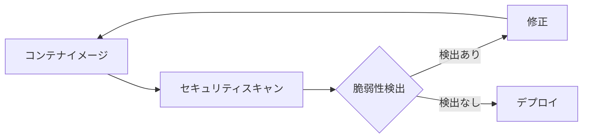

# Kubernetesセキュリティスキャナー

## 概要
Kubernetesセキュリティスキャナーは、コンテナイメージのデプロイ前に脆弱性や潜在的なセキュリティ脅威を特定するための重要なツールです。これらのツールは、DevSecOpsパイプラインに統合することで、Kubernetes環境のセキュリティと整合性を確保し、セキュリティ侵害やデータ損失のリスクを最小限に抑えることができます。

## 主要な機能と概念
セキュリティスキャナーは以下の主要な機能を提供します：

- コンテナイメージの脆弱性スキャン
- コンプライアンスチェック
- ランタイム保護
- セキュリティポリシーの適用
- 継続的なセキュリティモニタリング

## 主要なセキュリティスキャナー

### オープンソースツール
1. **Trivy**
   - 軽量で高速なスキャナー
   - コンテナイメージ、Kubernetesマニフェスト、IaCのスキャンに対応
   - CI/CDパイプラインへの統合が容易

2. **Anchore Engine**
   - 詳細な脆弱性分析
   - カスタマイズ可能なポリシーチェック
   - コンテナレジストリとの統合

3. **Starboard**
   - Kubernetesネイティブなセキュリティツール
   - 複数のセキュリティスキャナーを統合
   - セキュリティ情報の一元管理

### 商用ツール
1. **Aqua Security**
   - 包括的なセキュリティプラットフォーム
   - コンテナ、Kubernetes、サーバーレス環境の保護
   - 高度なランタイム保護機能

2. **Sysdig Secure**
   - リアルタイムのセキュリティモニタリング
   - フォレンジック分析機能
   - クラウドネイティブ環境の保護

## セキュリティスキャンのワークフロー

## ベストプラクティス

1. **CI/CDパイプラインへの統合**
   - ビルドプロセスの一部として自動スキャンを実施
   - 脆弱性が検出された場合はデプロイをブロック

2. **定期的なスキャン**
   - 新規脆弱性の検出のため、定期的なスキャンを実施
   - 既存のデプロイメントの継続的なモニタリング

3. **セキュリティポリシーの設定**
   - 組織の要件に基づいたセキュリティポリシーの定義
   - ポリシー違反時の自動対応の設定

## セキュリティ上の考慮事項

- スキャナー自体のセキュリティ設定の確認
- スキャン結果の適切な管理とアクセス制御
- 誤検知（False Positive）の管理と対応
- スキャン結果に基づく迅速な対応プロセスの確立

## 参考資料

- [8 Open Source Kubernetes Vulnerability Scanners](https://techbeacon.com/security/8-open-source-kubernetes-vulnerability-scanners-consider)
- [Improve Security With Automated Image Scanning](https://thenewstack.io/improve-security-with-automated-image-scanning-through-ci-cd/)
- [Starboard: Kubernetes Security Tool](https://thenewstack.io/starboard-putting-all-the-kubernetes-security-pieces-into-one-place/)
