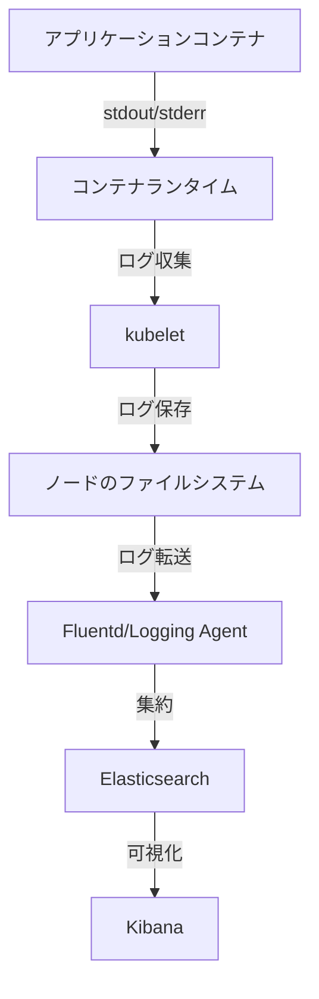

# Kubernetesのログ管理

## 概要
Kubernetesクラスター内のコンテナ化されたアプリケーションは、様々なログを生成します。これらのログは、アプリケーションの動作監視、トラブルシューティング、セキュリティ監査などに重要な役割を果たします。

## 主要概念
Kubernetesでは、コンテナの標準出力（stdout）と標準エラー出力（stderr）が自動的にログとして収集されます。これらのログは、kubectlコマンドを使用して簡単にアクセスできます。

## 基本的なログ管理

### kubectlを使用したログの取得
```bash
# 基本的なログ表示
kubectl logs <pod-name>

# 特定のコンテナのログを表示
kubectl logs <pod-name> -c <container-name>

# リアルタイムでログを追跡
kubectl logs -f <pod-name>

# 過去のログを表示（例：直近100行）
kubectl logs --tail=100 <pod-name>
```

### ログの保存場所
- コンテナログは、ノード上の `/var/log/containers/` ディレクトリに保存されます
- システムコンポーネント（kubelet, kube-proxy等）のログは、ノードの `/var/log/` ディレクトリに保存されます

## 高度なログ管理ソリューション

### EFKスタック
- Elasticsearch: ログの保存と検索
- Fluentd: ログの収集と転送
- Kibana: ログの可視化

### Prometheus + Grafana
- Prometheus: メトリクスとログの収集
- Grafana: 可視化とアラート設定

## ログ管理のベストプラクティス

1. ログのローテーション
   - ディスク容量の管理
   - 古いログの自動アーカイブ

2. セキュリティ考慮事項
   - 機密情報のログ出力を避ける
   - ログへのアクセス制御
   - ログの暗号化

3. ログレベル
   - ERROR: エラー情報
   - WARN: 警告情報
   - INFO: 一般情報
   - DEBUG: デバッグ情報

## ログ管理のアーキテクチャ



## 参考資料
- [Kubernetes公式ドキュメント: システムログ](https://kubernetes.io/docs/concepts/cluster-administration/system-logs/)
- [Kubernetes: Log collection explained](https://www.youtube.com/watch?v=6kmHvXdAzIM)
