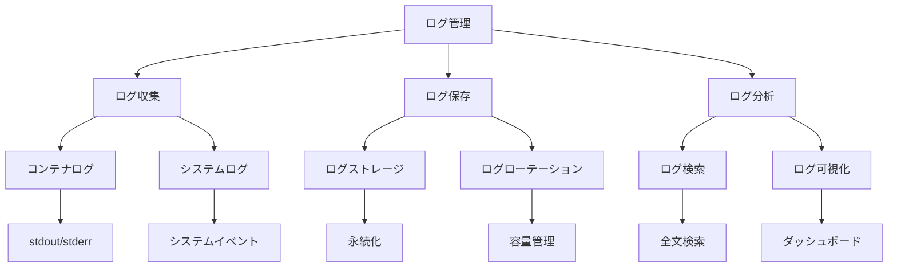

# ログ

Kubernetesクラスターの可観測性を確保するためには、適切なログ管理が重要です。コンテナ、ポッド、ノード、コントロールプレーンなど、様々なコンポーネントからのログを収集、保存、分析することで、システムの動作状態を把握し、問題の早期発見と対応が可能になります。

## なぜ必要なのか

### ログ管理がない場合の問題点
- システムの動作状態が把握できない
- 問題発生時の原因特定が困難
- セキュリティインシデントの検出が遅れる
- パフォーマンス問題の分析が困難

### ログ管理を導入するメリット
- システムの動作状態の可視化
- 問題の早期発見と迅速な対応
- セキュリティインシデントの検出
- パフォーマンスの分析と最適化

## 重要なポイント

ログ管理は、クラスターの健全性を維持し、問題の早期発見と対応を可能にするために重要です。適切なログ収集、保存、分析の仕組みを構築することで、システムの信頼性と運用効率を向上させることができます。

## 実装例

### Fluentdを使用したログ収集

```yaml
apiVersion: v1
kind: ConfigMap
metadata:
  name: fluentd-config
data:
  fluent.conf: |
    <source>
      @type tail
      path /var/log/containers/*.log
      pos_file /var/log/fluentd-containers.log.pos
      tag kubernetes.*
      read_from_head true
      <parse>
        @type json
        time_format %Y-%m-%dT%H:%M:%S.%NZ
      </parse>
    </source>
    <match kubernetes.**>
      @type elasticsearch
      host elasticsearch
      port 9200
      logstash_format true
      logstash_prefix k8s
      <buffer>
        @type file
        path /var/log/fluentd-buffers/kubernetes.buffer
        flush_mode interval
        timekey 1d
        timekey_use_utc true
        timekey_wait 10m
      </buffer>
    </match>
---
apiVersion: apps/v1
kind: DaemonSet
metadata:
  name: fluentd
spec:
  selector:
    matchLabels:
      app: fluentd
  template:
    metadata:
      labels:
        app: fluentd
    spec:
      containers:
      - name: fluentd
        image: fluent/fluentd-kubernetes-daemonset:v1-debian-elasticsearch
        volumeMounts:
        - name: varlog
          mountPath: /var/log
        - name: varlibdockercontainers
          mountPath: /var/lib/docker/containers
          readOnly: true
        - name: fluentd-config
          mountPath: /fluentd/etc/fluent.conf
          subPath: fluent.conf
      volumes:
      - name: varlog
        hostPath:
          path: /var/log
      - name: varlibdockercontainers
        hostPath:
          path: /var/lib/docker/containers
      - name: fluentd-config
        configMap:
          name: fluentd-config
```

### ElasticsearchとKibanaの設定

```yaml
apiVersion: apps/v1
kind: StatefulSet
metadata:
  name: elasticsearch
spec:
  serviceName: elasticsearch
  replicas: 3
  selector:
    matchLabels:
      app: elasticsearch
  template:
    metadata:
      labels:
        app: elasticsearch
    spec:
      containers:
      - name: elasticsearch
        image: docker.elastic.co/elasticsearch/elasticsearch:7.9.3
        ports:
        - containerPort: 9200
        - containerPort: 9300
        volumeMounts:
        - name: data
          mountPath: /usr/share/elasticsearch/data
        env:
        - name: discovery.type
          value: single-node
        - name: ES_JAVA_OPTS
          value: "-Xms512m -Xmx512m"
      volumes:
      - name: data
        persistentVolumeClaim:
          claimName: elasticsearch-data
---
apiVersion: apps/v1
kind: Deployment
metadata:
  name: kibana
spec:
  replicas: 1
  selector:
    matchLabels:
      app: kibana
  template:
    metadata:
      labels:
        app: kibana
    spec:
      containers:
      - name: kibana
        image: docker.elastic.co/kibana/kibana:7.9.3
        ports:
        - containerPort: 5601
        env:
        - name: ELASTICSEARCH_HOSTS
          value: http://elasticsearch:9200
```

## セキュリティの仕組み



## セキュリティ考慮事項

- ログの暗号化
- アクセス制御の設定
- ログの保持期間の管理
- 機密情報のマスキング
- ログの整合性確保

## 参考資料

- [Kubernetesログ管理のベストプラクティス](https://kubernetes.io/docs/concepts/cluster-administration/logging/)
- [ElasticsearchとKibanaを使用したログ管理](https://www.elastic.co/guide/en/elasticsearch/reference/current/index.html)
- [Fluentdによるログ収集の設定](https://docs.fluentd.org/) 
