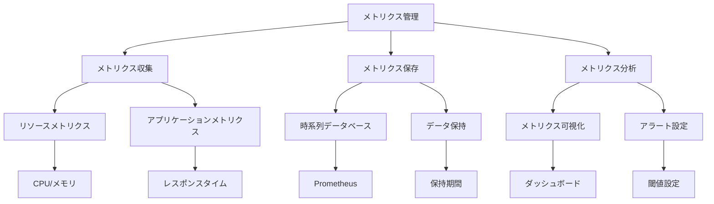

# メトリクス

Kubernetesクラスターの可観測性を確保するためには、適切なメトリクス収集と分析が重要です。CPU、メモリ、ディスク、ネットワークなどのリソース使用状況や、アプリケーションのパフォーマンス指標を収集することで、システムの健全性を監視し、問題の早期発見と対応が可能になります。

## なぜ必要なのか

### メトリクス収集がない場合の問題点
- リソース使用状況の把握が困難
- パフォーマンス問題の早期発見が困難
- スケーリング判断の根拠が不明確
- システムの健全性評価が主観的

### メトリクス収集を導入するメリット
- リソース使用状況の可視化
- パフォーマンス問題の早期発見
- データに基づくスケーリング判断
- システムの健全性の客観的評価

## 重要なポイント

メトリクス収集は、クラスターのパフォーマンスを最適化し、リソースの効率的な利用を実現するために重要です。適切なメトリクスの収集、保存、分析の仕組みを構築することで、システムの信頼性と運用効率を向上させることができます。

## 実装例

### Prometheusの設定

```yaml
apiVersion: v1
kind: ConfigMap
metadata:
  name: prometheus-config
data:
  prometheus.yml: |
    global:
      scrape_interval: 15s
      evaluation_interval: 15s
    scrape_configs:
      - job_name: 'kubernetes-apiservers'
        kubernetes_sd_configs:
        - role: endpoints
        scheme: https
        tls_config:
          ca_file: /var/run/secrets/kubernetes.io/serviceaccount/ca.crt
        bearer_token_file: /var/run/secrets/kubernetes.io/serviceaccount/token
        relabel_configs:
        - source_labels: [__meta_kubernetes_namespace, __meta_kubernetes_service_name, __meta_kubernetes_endpoint_port_name]
          action: keep
          regex: default;kubernetes;https
      - job_name: 'kubernetes-nodes'
        scheme: https
        tls_config:
          ca_file: /var/run/secrets/kubernetes.io/serviceaccount/ca.crt
        bearer_token_file: /var/run/secrets/kubernetes.io/serviceaccount/token
        kubernetes_sd_configs:
        - role: node
        relabel_configs:
        - action: labelmap
          regex: __meta_kubernetes_node_label_(.+)
---
apiVersion: apps/v1
kind: Deployment
metadata:
  name: prometheus
spec:
  replicas: 1
  selector:
    matchLabels:
      app: prometheus
  template:
    metadata:
      labels:
        app: prometheus
    spec:
      containers:
      - name: prometheus
        image: prom/prometheus:v2.30.3
        ports:
        - containerPort: 9090
        volumeMounts:
        - name: config
          mountPath: /etc/prometheus
        - name: storage
          mountPath: /prometheus
      volumes:
      - name: config
        configMap:
          name: prometheus-config
      - name: storage
        emptyDir: {}
```

### Grafanaの設定

```yaml
apiVersion: apps/v1
kind: Deployment
metadata:
  name: grafana
spec:
  replicas: 1
  selector:
    matchLabels:
      app: grafana
  template:
    metadata:
      labels:
        app: grafana
    spec:
      containers:
      - name: grafana
        image: grafana/grafana:8.2.0
        ports:
        - containerPort: 3000
        volumeMounts:
        - name: storage
          mountPath: /var/lib/grafana
        env:
        - name: GF_SECURITY_ADMIN_PASSWORD
          valueFrom:
            secretKeyRef:
              name: grafana-admin
              key: password
      volumes:
      - name: storage
        persistentVolumeClaim:
          claimName: grafana-data
```

## セキュリティの仕組み



## セキュリティ考慮事項

- メトリクスエンドポイントの保護
- アクセス制御の設定
- メトリクスデータの暗号化
- アラート設定の最適化
- メトリクスデータの整合性確保

## 参考資料

- [Kubernetesメトリクス管理のベストプラクティス](https://kubernetes.io/docs/tasks/debug-application-cluster/resource-metrics-pipeline/)
- [Prometheusによるメトリクス収集](https://prometheus.io/docs/introduction/overview/)
- [Grafanaによるメトリクス可視化](https://grafana.com/docs/) 
