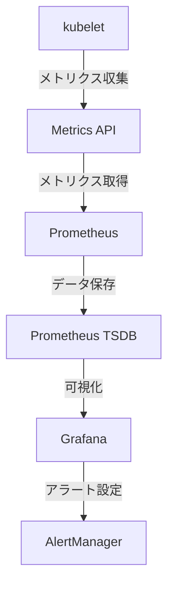

# Kubernetesメトリクス監視

Kubernetesクラスターの健全性とパフォーマンスを確保するためには、包括的なメトリクス監視が不可欠です。適切なメトリクス監視により、潜在的な問題を早期に発見し、リソースの最適化を行うことができます。

## 主要な監視メトリクス

Kubernetesクラスターでは、以下の主要なメトリクスを監視することが重要です：

1. **ノードレベルのメトリクス**
   - CPU使用率
   - メモリ使用率
   - ディスク使用率
   - ネットワークトラフィック

2. **コンテナレベルのメトリクス**
   - CPU使用率
   - メモリ使用率
   - ネットワークI/O
   - ディスクI/O

3. **クラスター全体のメトリクス**
   - APIサーバーのパフォーマンス
   - スケジューラーの状態
   - etcdの健全性
   - コントローラーマネージャーの状態

## メトリクス収集の仕組み

Kubernetesでは、kubeletが各ノード上でメトリクスを収集し、Metrics APIを通じて公開します。このAPIは、Prometheusなどの監視ツールがメトリクスを収集するための標準的なインターフェースを提供します。



## 実装例：Prometheus + Grafana

以下は、PrometheusとGrafanaを使用した基本的なメトリクス監視のセットアップ例です：

```yaml
# prometheus-config.yaml
apiVersion: v1
kind: ConfigMap
metadata:
  name: prometheus-config
data:
  prometheus.yml: |
    global:
      scrape_interval: 15s
    scrape_configs:
      - job_name: 'kubernetes-apiservers'
        kubernetes_sd_configs:
          - role: endpoints
        scheme: https
        tls_config:
          ca_file: /var/run/secrets/kubernetes.io/serviceaccount/ca.crt
        bearer_token_file: /var/run/secrets/kubernetes.io/serviceaccount/token
```

## ベストプラクティス

1. **アラートの設定**
   - 重要なメトリクスに対して適切なしきい値を設定
   - 誤検知を防ぐための適切なクールダウン期間の設定

2. **メトリクスの保持期間**
   - 長期トレンド分析のための適切なデータ保持期間の設定
   - ストレージコストの最適化

3. **セキュリティ考慮事項**
   - メトリクスエンドポイントへのアクセス制限
   - センシティブなメトリクスデータの保護

## 参考資料

- [公式ドキュメント：Node Metrics Data](https://kubernetes.io/docs/reference/instrumentation/node-metrics/)
- [Prometheus公式ドキュメント](https://prometheus.io/docs/introduction/overview/)
- [Grafana公式ドキュメント](https://grafana.com/docs/)
