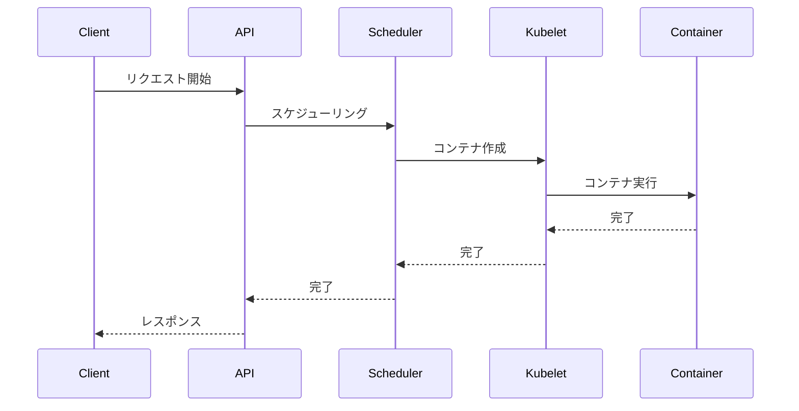

# Kubernetesトレース

Kubernetesクラスター内のリクエストフローを追跡・分析するトレース機能は、システムのパフォーマンス最適化と問題解決に不可欠です。OpenTelemetryプロトコルを使用したトレース機能により、クラスター全体の動作を詳細に把握することができます。

## トレースの基本概念

トレースは、リクエストがシステム内を通過する際の一連の操作（スパン）を記録します。各スパンには以下の情報が含まれます：

- 操作の開始時間と終了時間
- 操作の種類と名前
- 関連するメタデータ
- 親子関係（トレースコンテキスト）



## 主要コンポーネントのトレース

### kube-apiserverのトレース

kube-apiserverは以下の操作のトレースを生成します：

- 受信HTTPリクエスト
- webhookへの送信リクエスト
- etcdへのリクエスト
- 再帰的なリクエスト

設定例：
```yaml
apiVersion: apiserver.config.k8s.io/v1beta1
kind: TracingConfiguration
samplingRatePerMillion: 100  # 10000リクエストに1回のサンプリング
```

### kubeletのトレース

kubeletは以下の操作のトレースを生成します：

- CRIインターフェースの操作
- 認証済みHTTPサーバーの操作
- ガベージコレクション
- Pod同期ルーチン

設定例：
```yaml
apiVersion: kubelet.config.k8s.io/v1beta1
kind: KubeletConfiguration
featureGates:
  KubeletTracing: true
tracing:
  samplingRatePerMillion: 100
```

## トレース収集の実装

OpenTelemetry Collectorを使用したトレース収集の基本設定：

```yaml
receivers:
  otlp:
    protocols:
      grpc:
exporters:
  logging:
    logLevel: debug
service:
  pipelines:
    traces:
      receivers: [otlp]
      exporters: [logging]
```

## ベストプラクティス

1. **サンプリングレートの設定**
   - システムの負荷に応じて適切なサンプリングレートを設定
   - 重要な操作は100%サンプリングを検討

2. **トレースの保持期間**
   - 分析目的に応じた適切な保持期間の設定
   - ストレージコストの最適化

3. **セキュリティ考慮事項**
   - トレースデータの暗号化
   - センシティブな情報の除外
   - アクセス制御の設定

## 参考資料

- [公式ドキュメント：System Traces](https://kubernetes.io/docs/concepts/cluster-administration/system-traces/)
- [OpenTelemetry Collector 入門](https://opentelemetry.io/docs/collector/getting-started/)
- [OpenTelemetry Protocol 仕様](https://github.com/open-telemetry/opentelemetry-specification/blob/main/specification/protocol/otlp.md)
