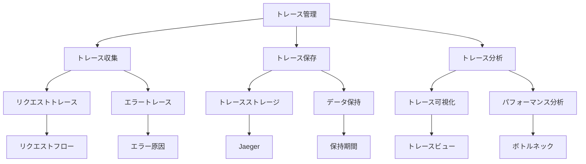

# トレース

Kubernetesクラスターの可観測性を確保するためには、適切なトレース管理が重要です。分散システムにおけるリクエストの流れを追跡し、パフォーマンスのボトルネックやエラーの原因を特定することで、システムの信頼性と運用効率を向上させることができます。

## なぜ必要なのか

### トレース管理がない場合の問題点
- リクエストの流れが追跡できない
- パフォーマンス問題の原因特定が困難
- エラーの影響範囲の把握が困難
- システムの動作理解が不十分

### トレース管理を導入するメリット
- リクエストの流れの可視化
- パフォーマンス問題の原因特定
- エラーの影響範囲の把握
- システムの動作理解の向上

## 重要なポイント

トレース管理は、分散システムの複雑な動作を理解し、問題の早期発見と対応を可能にするために重要です。適切なトレース収集、保存、分析の仕組みを構築することで、システムの信頼性と運用効率を向上させることができます。

## 実装例

### Jaegerの設定

```yaml
apiVersion: apps/v1
kind: Deployment
metadata:
  name: jaeger
spec:
  replicas: 1
  selector:
    matchLabels:
      app: jaeger
  template:
    metadata:
      labels:
        app: jaeger
    spec:
      containers:
      - name: jaeger
        image: jaegertracing/all-in-one:1.30
        ports:
        - containerPort: 5775
          protocol: UDP
        - containerPort: 6831
          protocol: UDP
        - containerPort: 6832
          protocol: UDP
        - containerPort: 5778
          protocol: TCP
        - containerPort: 16686
          protocol: TCP
        - containerPort: 14250
          protocol: TCP
        - containerPort: 14268
          protocol: TCP
        - containerPort: 14269
          protocol: TCP
        - containerPort: 9411
          protocol: TCP
        env:
        - name: SPAN_STORAGE_TYPE
          value: memory
        - name: COLLECTOR_ZIPKIN_HOST_PORT
          value: :9411
```

### OpenTelemetryの設定

```yaml
apiVersion: apps/v1
kind: ConfigMap
metadata:
  name: opentelemetry-config
data:
  config.yaml: |
    receivers:
      jaeger:
        protocols:
          grpc:
            endpoint: 0.0.0.0:14250
          thrift_binary:
            endpoint: 0.0.0.0:6832
          thrift_compact:
            endpoint: 0.0.0.0:6831
          thrift_http:
            endpoint: 0.0.0.0:14268
      zipkin:
        endpoint: 0.0.0.0:9411
    processors:
      batch:
        timeout: 1s
        send_batch_size: 1024
    exporters:
      jaeger:
        endpoint: jaeger:14250
        tls:
          insecure: true
    service:
      pipelines:
        traces:
          receivers: [jaeger, zipkin]
          processors: [batch]
          exporters: [jaeger]
---
apiVersion: apps/v1
kind: Deployment
metadata:
  name: opentelemetry-collector
spec:
  replicas: 1
  selector:
    matchLabels:
      app: opentelemetry-collector
  template:
    metadata:
      labels:
        app: opentelemetry-collector
    spec:
      containers:
      - name: opentelemetry-collector
        image: otel/opentelemetry-collector:0.40.0
        ports:
        - containerPort: 14250
        - containerPort: 14268
        - containerPort: 9411
        volumeMounts:
        - name: config
          mountPath: /conf
        command:
        - "/otelcol"
        - "--config=/conf/config.yaml"
      volumes:
      - name: config
        configMap:
          name: opentelemetry-config
```

## セキュリティの仕組み



## セキュリティ考慮事項

- トレースデータの暗号化
- アクセス制御の設定
- 機密情報のマスキング
- トレースデータの保持期間管理
- トレースデータの整合性確保

## 参考資料

- [Kubernetesトレース管理のベストプラクティス](https://kubernetes.io/docs/concepts/cluster-administration/logging/)
- [Jaegerによるトレース管理](https://www.jaegertracing.io/docs/1.30/)
- [OpenTelemetryによるトレース収集](https://opentelemetry.io/docs/) 
