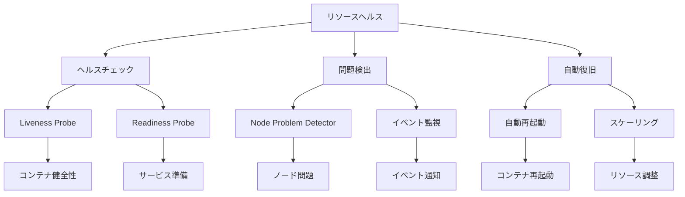

# リソースヘルス

Kubernetesクラスターの可観測性を確保するためには、適切なリソースヘルス監視が重要です。ノード、ポッド、コンテナなどのリソースの健全性を監視し、問題の早期発見と対応を可能にすることで、システムの信頼性と運用効率を向上させることができます。

## なぜ必要なのか

### リソースヘルス監視がない場合の問題点
- リソースの異常を早期に検出できない
- 問題発生時の影響範囲の把握が困難
- 自動復旧の判断が遅れる
- システムの健全性評価が不十分

### リソースヘルス監視を導入するメリット
- リソースの異常を早期に検出
- 問題の影響範囲を迅速に把握
- 自動復旧の迅速な判断
- システムの健全性の継続的な評価

## 重要なポイント

リソースヘルス監視は、クラスターの健全性を維持し、問題の早期発見と対応を可能にするために重要です。適切なヘルスチェックと監視の仕組みを構築することで、システムの信頼性と運用効率を向上させることができます。

## 実装例

### Liveness Probeの設定

```yaml
apiVersion: apps/v1
kind: Deployment
metadata:
  name: nginx
spec:
  replicas: 3
  selector:
    matchLabels:
      app: nginx
  template:
    metadata:
      labels:
        app: nginx
    spec:
      containers:
      - name: nginx
        image: nginx:1.19
        ports:
        - containerPort: 80
        livenessProbe:
          httpGet:
            path: /
            port: 80
          initialDelaySeconds: 15
          periodSeconds: 20
        readinessProbe:
          httpGet:
            path: /
            port: 80
          initialDelaySeconds: 5
          periodSeconds: 10
```

### Node Problem Detectorの設定

```yaml
apiVersion: apps/v1
kind: DaemonSet
metadata:
  name: node-problem-detector
spec:
  selector:
    matchLabels:
      app: node-problem-detector
  template:
    metadata:
      labels:
        app: node-problem-detector
    spec:
      containers:
      - name: node-problem-detector
        image: k8s.gcr.io/node-problem-detector:v0.8.10
        securityContext:
          privileged: true
        volumeMounts:
        - name: log
          mountPath: /var/log
          readOnly: true
        - name: localtime
          mountPath: /etc/localtime
          readOnly: true
        - name: config
          mountPath: /config
          readOnly: true
      volumes:
      - name: log
        hostPath:
          path: /var/log
      - name: localtime
        hostPath:
          path: /etc/localtime
      - name: config
        configMap:
          name: node-problem-detector-config
```

## セキュリティの仕組み



## セキュリティ考慮事項

- ヘルスチェックエンドポイントの保護
- 監視データの暗号化
- アクセス制御の設定
- アラート設定の最適化
- 監視データの整合性確保

## 参考資料

- [Kubernetesヘルスチェックのベストプラクティス](https://kubernetes.io/docs/tasks/configure-pod-container/configure-liveness-readiness-startup-probes/)
- [Node Problem Detectorの設定](https://kubernetes.io/docs/tasks/debug-application-cluster/monitor-node-health/)
- [Kubernetesイベント監視](https://kubernetes.io/docs/concepts/architecture/events/) 
