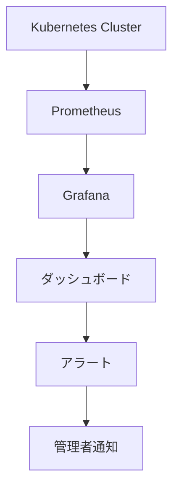
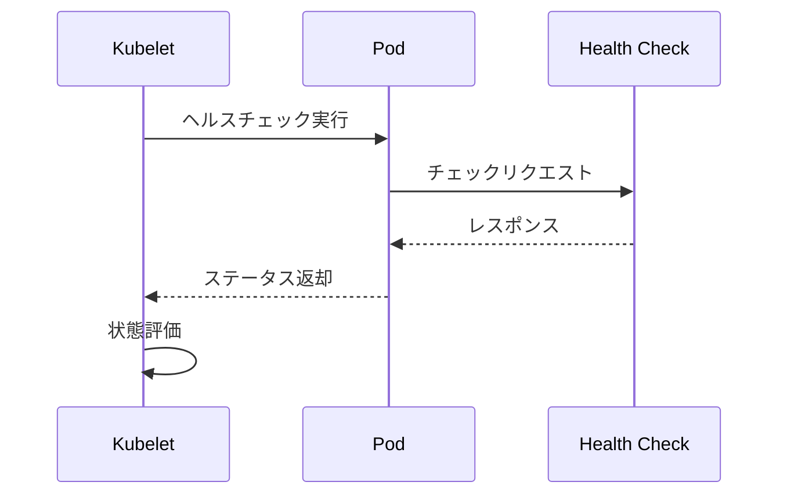

# リソースヘルス

## 概要
Kubernetesにおけるリソースヘルスモニタリングは、クラスター内のポッド、ノード、コンテナなどのリソースの健全性と可用性を監視する重要な機能です。システムの信頼性、可用性、スケーラビリティを確保するために不可欠な要素となっています。

## 主要概念
リソースヘルスモニタリングは、Kubernetes Dashboard、Prometheus、Grafanaなどのツールを使用して、システムのパフォーマンスと可用性に影響を与える可能性のある問題を特定し、トラブルシューティングを行うことを可能にします。また、システムの耐障害性を確保し、障害からの迅速な回復を実現します。

## 実装例とユースケース
### PrometheusとGrafanaを使用したモニタリング
```yaml
# prometheus-config.yaml
apiVersion: v1
kind: ConfigMap
metadata:
  name: prometheus-config
data:
  prometheus.yml: |
    global:
      scrape_interval: 15s
    scrape_configs:
      - job_name: 'kubernetes-pods'
        kubernetes_sd_configs:
          - role: pod
```

### ヘルスチェックの設定例
```yaml
# pod-health-check.yaml
apiVersion: v1
kind: Pod
metadata:
  name: health-check-example
spec:
  containers:
  - name: nginx
    image: nginx
    livenessProbe:
      httpGet:
        path: /health
        port: 80
      initialDelaySeconds: 3
      periodSeconds: 3
```

## 視覚化
### リソースヘルスモニタリングの基本フロー


### ヘルスチェックのシーケンス


## セキュリティ考慮事項
- モニタリングツールへのアクセス制御を適切に設定
- センシティブなメトリクスデータの保護
- アラート通知のセキュアな設定

## 参考資料
- [Kubernetes公式ドキュメント - ヘルスチェック](https://kubernetes.io/docs/tasks/configure-pod-container/configure-liveness-readiness-startup-probes/)
- [Prometheus公式ドキュメント](https://prometheus.io/docs/introduction/overview/)
- [Grafana公式ドキュメント](https://grafana.com/docs/)
