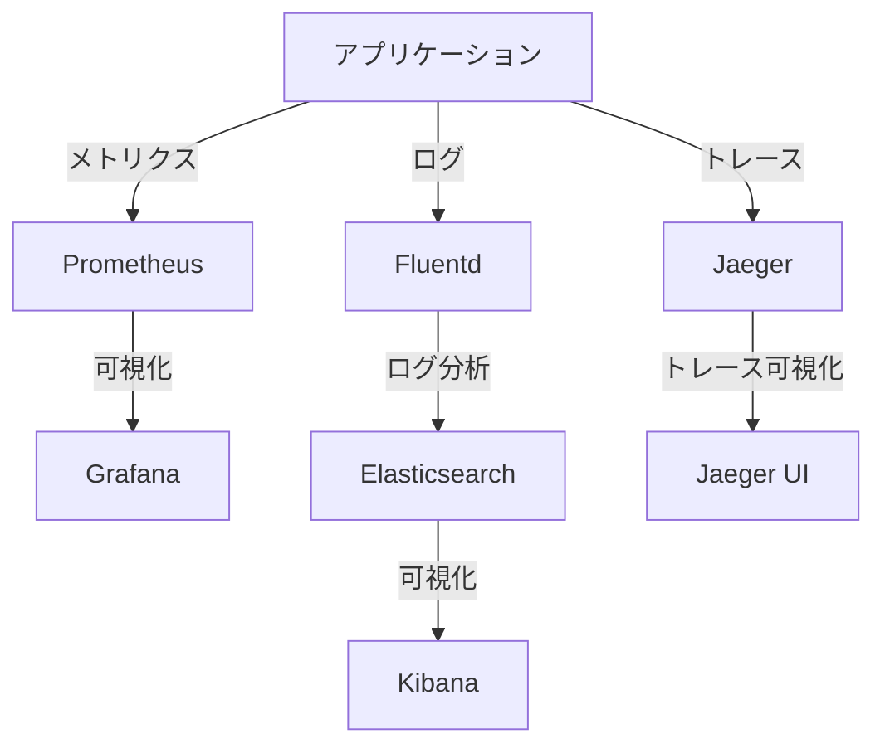

# Kubernetes可観測性エンジン

Kubernetesの可観測性エンジンは、クラスター内のアプリケーションやサービスの動作を監視・分析し、問題の早期発見と解決を支援する重要なツールです。

## 主要概念

可観測性エンジンは、メトリクス、ログ、トレースの3つの主要なデータソースを統合し、システムの健全性とパフォーマンスを包括的に把握することを可能にします。

## 主要な可観測性エンジン

### 1. Prometheus + Grafana
- 時系列メトリクスの収集と保存
- アラート管理
- カスタマイズ可能なダッシュボード

### 2. ELK Stack (Elasticsearch, Logstash, Kibana)
- ログの収集と分析
- 全文検索機能
- リアルタイムログ分析

### 3. Jaeger
- 分散トレーシング
- サービス間の依存関係の可視化
- パフォーマンス分析

### 4. AIベースの可観測性ツール
- k8sgpt: Kubernetesの問題をAIで自動検出
- HolmesGPT: Prometheusアラートの自動分析

## 実装例

```yaml
# Prometheusの基本的な設定例
apiVersion: monitoring.coreos.com/v1
kind: ServiceMonitor
metadata:
  name: example-app
  namespace: monitoring
spec:
  selector:
    matchLabels:
      app: example-app
  endpoints:
  - port: metrics
    interval: 15s
```

## 可観測性の基本構成



## ベストプラクティス

1. **包括的な監視**
   - インフラストラクチャレベル
   - アプリケーションレベル
   - ビジネスメトリクス

2. **アラート設定**
   - 適切な閾値設定
   - アラートの優先度付け
   - 自動修復の検討

3. **データ保持ポリシー**
   - コスト最適化
   - コンプライアンス要件への対応
   - データの重要度に基づく保持期間の設定

## セキュリティ考慮事項

- メトリクスとログの暗号化
- アクセス制御の実装
- 機密情報のマスキング
- 監査ログの保持

## 参考資料

- [Kubernetes Observability 101](https://www.cloudzero.com/blog/kubernetes-observability)
- [KubeSphere Observability](https://kubesphere.io/observability/)
- [k8sgpt GitHub](https://github.com/k8sgpt-ai/k8sgpt)
- [HolmesGPT GitHub](https://github.com/robusta-dev/holmesgpt/)
