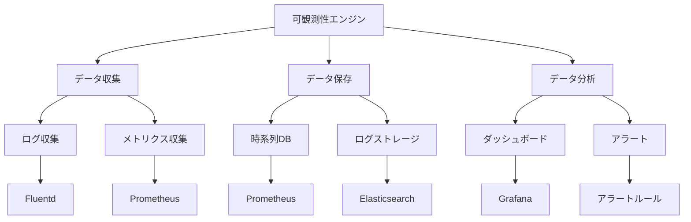

# 可観測性エンジン

Kubernetesクラスターの可観測性を確保するためには、適切な可観測性エンジンの構築が重要です。ログ、メトリクス、トレース、ヘルスチェックなどのデータを統合し、システムの状態を包括的に監視・分析することで、問題の早期発見と対応が可能になります。

## なぜ必要なのか

### 可観測性エンジンがない場合の問題点
- システムの状態把握が困難
- 問題の原因特定に時間がかかる
- インシデント対応が遅れる
- システムの健全性評価が不十分

### 可観測性エンジンを導入するメリット
- システムの状態を包括的に把握
- 問題の原因を迅速に特定
- インシデントへの迅速な対応
- システムの健全性を継続的に評価

## 重要なポイント

可観測性エンジンは、クラスターの健全性を維持し、問題の早期発見と対応を可能にするために重要です。適切なデータ収集、保存、分析の仕組みを構築することで、システムの信頼性と運用効率を向上させることができます。

## 実装例

### Prometheus Operatorの設定

```yaml
apiVersion: monitoring.coreos.com/v1
kind: ServiceMonitor
metadata:
  name: example-app
  labels:
    release: prometheus
spec:
  selector:
    matchLabels:
      app: example-app
  endpoints:
  - port: web
---
apiVersion: monitoring.coreos.com/v1
kind: PrometheusRule
metadata:
  name: example-app
  labels:
    release: prometheus
spec:
  groups:
  - name: example
    rules:
    - alert: HighRequestLatency
      expr: http_request_duration_seconds{job="example-app"} > 1
      for: 10m
      labels:
        severity: warning
      annotations:
        summary: High request latency
```

### Grafana Dashboardの設定

```yaml
apiVersion: v1
kind: ConfigMap
metadata:
  name: grafana-dashboards
data:
  kubernetes-cluster.json: |
    {
      "annotations": {
        "list": []
      },
      "editable": true,
      "fiscalYearStartMonth": 0,
      "graphTooltip": 0,
      "links": [],
      "liveNow": false,
      "panels": [],
      "refresh": "5s",
      "schemaVersion": 38,
      "style": "dark",
      "tags": [],
      "templating": {
        "list": []
      },
      "time": {
        "from": "now-6h",
        "to": "now"
      },
      "timepicker": {},
      "timezone": "",
      "title": "Kubernetes Cluster",
      "uid": "kubernetes-cluster",
      "version": 1,
      "weekStart": ""
    }
---
apiVersion: v1
kind: ConfigMap
metadata:
  name: grafana-datasources
data:
  prometheus.yaml: |
    apiVersion: 1
    datasources:
    - name: Prometheus
      type: prometheus
      url: http://prometheus:9090
      access: proxy
      isDefault: true
```

## セキュリティの仕組み



## セキュリティ考慮事項

- データ収集エンドポイントの保護
- 監視データの暗号化
- アクセス制御の設定
- アラート設定の最適化
- 監視データの整合性確保

## 参考資料

- [Kubernetes可観測性のベストプラクティス](https://kubernetes.io/docs/concepts/cluster-administration/logging/)
- [Prometheus Operatorの設定](https://prometheus-operator.dev/docs/user-guides/getting-started/)
- [Grafana Dashboardの作成](https://grafana.com/docs/grafana/latest/dashboards/) 
