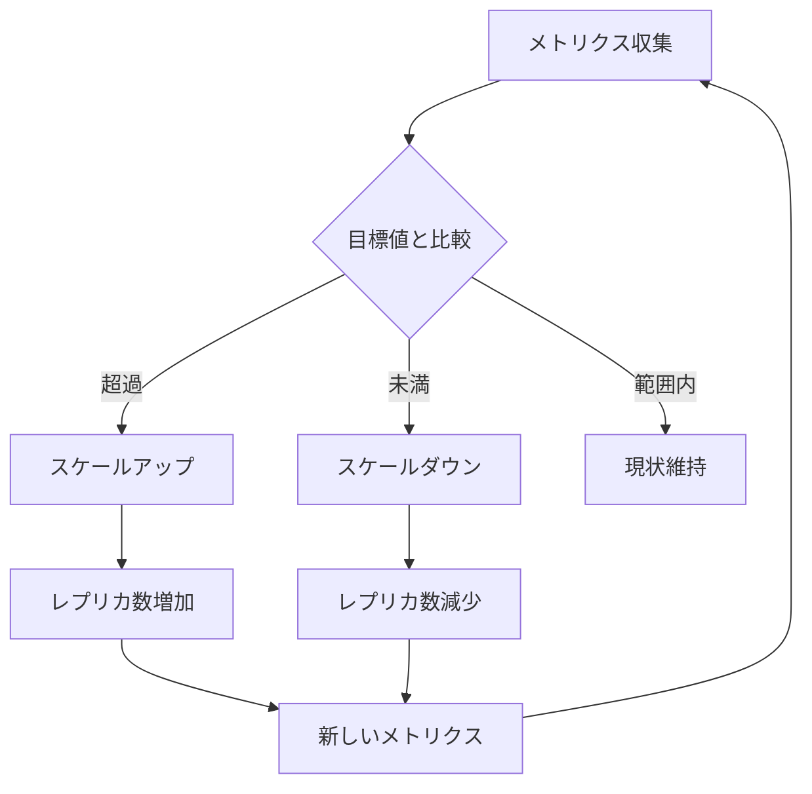
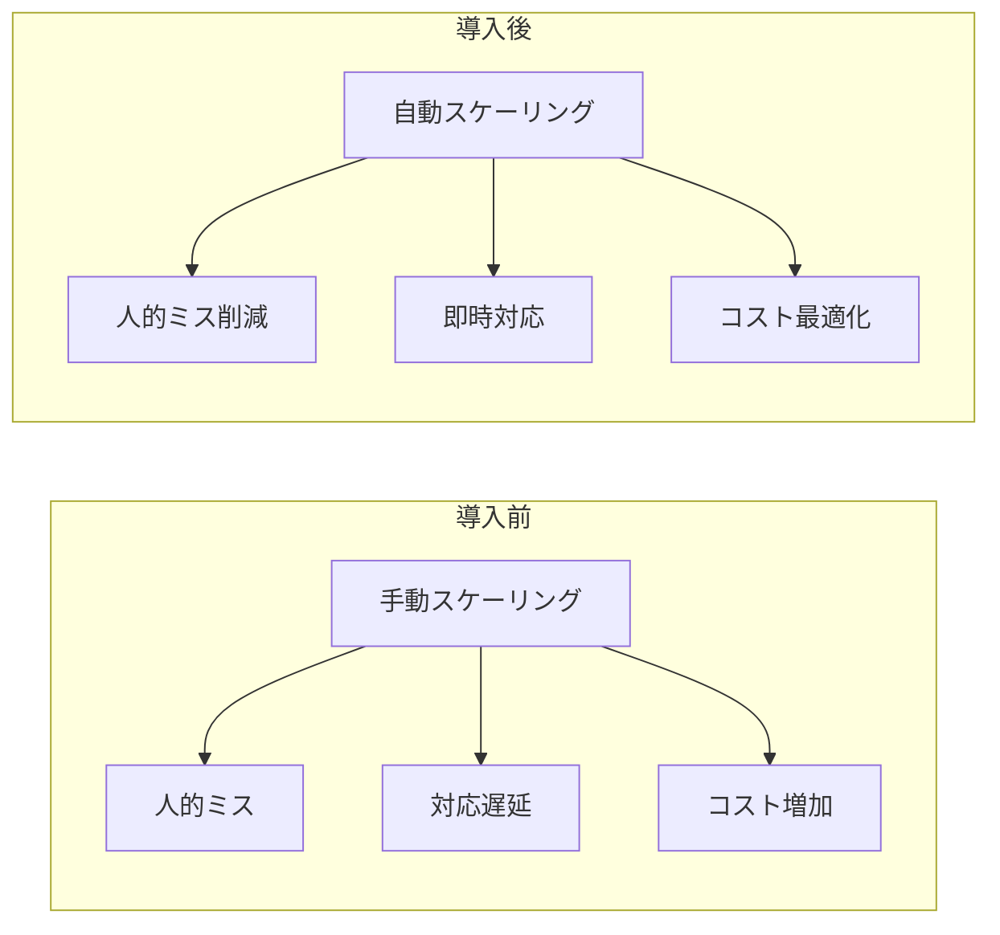

# 水平ポッドオートスケーラー（HPA）

## 概要
水平ポッドオートスケーラー（Horizontal Pod Autoscaler、HPA）は、Kubernetesクラスター内のワークロードの需要に応じて、自動的にポッドのレプリカ数を調整する機能です。CPU使用率やその他のメトリクスを監視し、指定された目標値に基づいてポッドの数を増減させます。

## なぜ必要なのか？

### HPAがない場合の問題点
1. 手動でのスケーリングが必要
   - トラフィックの急増時に手動でポッド数を増やす必要がある
   - 深夜や休日など、即時対応が難しい状況で問題が発生
   - 人的ミスのリスクが高い

2. リソースの非効率な利用
   - ピーク時の負荷に合わせて常に余裕を持ったリソースを確保
   - 低負荷時も多くのリソースを消費
   - クラウドコストの無駄遣い

3. 可用性の低下
   - スケーリングの遅れによるサービス停止
   - 過負荷によるパフォーマンス低下
   - ユーザー体験の悪化

### HPAを導入することで得られるメリット
1. 自動的なスケーリング
   - 24時間365日の自動監視と対応
   - 人的介入なしでの迅速なスケーリング
   - 人的ミスのリスク低減

2. コスト最適化
   - 需要に応じた適切なリソース配分
   - 不要なリソースの自動削減
   - クラウドコストの効率化

3. 高可用性の実現
   - トラフィック急増時の自動対応
   - 安定したパフォーマンスの維持
   - ユーザー体験の向上

## 主な機能と特徴

### 1. メトリクスベースのスケーリング
- CPU使用率
- メモリ使用率
- カスタムメトリクス
- 外部メトリクス

### 2. スケーリングポリシー
```yaml
apiVersion: autoscaling/v2
kind: HorizontalPodAutoscaler
metadata:
  name: example-hpa
spec:
  scaleTargetRef:
    apiVersion: apps/v1
    kind: Deployment
    name: example-deployment
  minReplicas: 1
  maxReplicas: 10
  metrics:
  - type: Resource
    resource:
      name: cpu
      target:
        type: Utilization
        averageUtilization: 80
```

### 3. スケーリング動作の制御
- スケールアップ/ダウンの安定化ウィンドウ
- スケーリングポリシーのカスタマイズ
- スケーリング方向の制限

## 図解による説明

### HPAの動作フロー


### 導入前後の比較


## 使用上の注意点

1. リソース要求の設定
   - 適切なCPU/メモリ要求を設定
   - リソース制限の適切な設定

2. スケーリング範囲の設定
   - 最小/最大レプリカ数の適切な設定
   - クラスターリソースの考慮

3. メトリクスの選択
   - アプリケーション特性に応じた適切なメトリクスの選択
   - カスタムメトリクスの活用

## 参考リンク
- [公式ドキュメント](https://kubernetes.io/docs/tasks/run-application/horizontal-pod-autoscale/)
