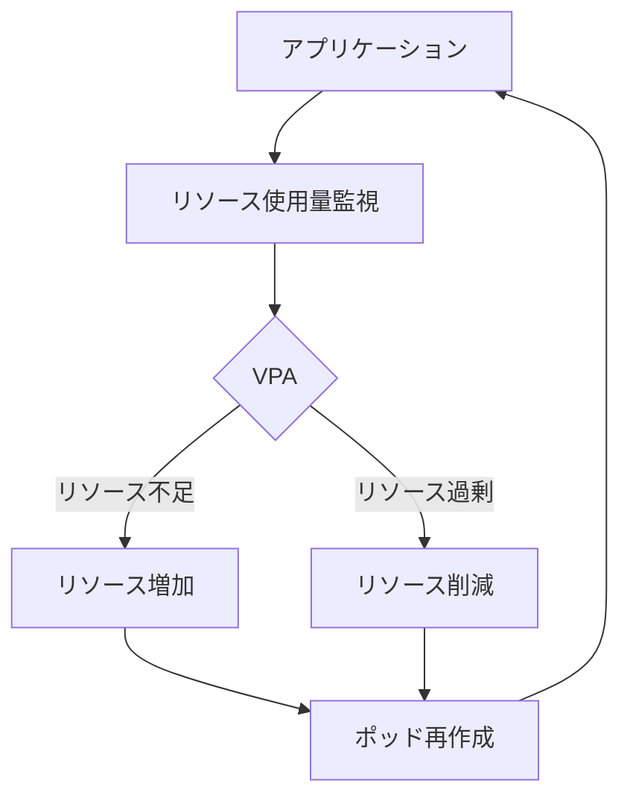

# 垂直ポッドオートスケーラー（VPA）

## 1. トピックの簡単な説明
垂直ポッドオートスケーラー（VPA）は、Kubernetesクラスター内のポッドのリソース使用量を監視し、必要に応じてCPUやメモリのリソース要求（requests）と制限（limits）を自動的に調整する機能です。

## 2. なぜ必要なのか

### この機能がないとどうなるのか
- リソースの過小設定：アプリケーションが十分なリソースを得られず、パフォーマンスが低下
- リソースの過大設定：不要なリソースが割り当てられ、クラスターの効率が低下
- 手動調整の必要性：運用者が定期的にリソース使用量を監視し、手動で調整する必要がある

### どのような問題が発生するのか
- リソースの無駄遣い：過剰なリソース割り当てによるコスト増加
- パフォーマンスの低下：リソース不足によるアプリケーションの応答性低下
- 運用負荷の増加：リソース監視と調整のための人的リソースの消費

### どのようなメリットがあるのか
- リソースの最適化：実際の使用量に基づいて適切なリソースを自動的に割り当て
- コスト削減：不要なリソース割り当てを防ぎ、クラスターの効率を向上
- 運用負荷の軽減：手動調整の必要性を削減
- アプリケーションの安定性向上：適切なリソース割り当てによるパフォーマンスの最適化

## 3. 重要なポイントの解説
VPAは、アプリケーションの実際のリソース使用パターンを学習し、それに基づいて最適なリソース割り当てを自動的に行います。これにより、リソースの過不足による問題を防ぎ、アプリケーションのパフォーマンスと安定性を向上させることができます。

## 4. 実際の使い方や具体例

### VPAの設定例
```yaml
apiVersion: autoscaling.k8s.io/v1
kind: VerticalPodAutoscaler
metadata:
  name: my-app-vpa
spec:
  targetRef:
    apiVersion: "apps/v1"
    kind: Deployment
    name: my-app
  updatePolicy:
    updateMode: "Auto"
  resourcePolicy:
    containerPolicies:
    - containerName: '*'
      minAllowed:
        cpu: 100m
        memory: 50Mi
      maxAllowed:
        cpu: 1
        memory: 500Mi
```

### 動作モード
1. **Off**: 推奨値のみを表示し、自動調整は行わない
2. **Initial**: ポッド作成時のみリソースを調整
3. **Auto**: ポッドの再作成を行いながら自動的にリソースを調整

## 5. 図解による説明



## 注意点とベストプラクティス

1. **HPAとの併用**
   - CPUやメモリメトリクスを使用するHPAとVPAを同時に使用することは避ける
   - カスタムメトリクスを使用するHPAであれば、VPAと併用可能

2. **リソース制限の設定**
   - `minAllowed`と`maxAllowed`を適切に設定し、予期せぬリソース変動を防ぐ
   - アプリケーションの特性に応じて制限値を調整

3. **ステートフルアプリケーション**
   - ステートフルアプリケーションでは、VPAの使用が特に効果的
   - データの永続性を考慮した設定が必要

4. **モニタリングとコスト管理**
   - VPAの動作状況を定期的に監視
   - リソース使用量の変動に応じたコスト管理の仕組みを整備

## 参考リンク
- [Kubernetes VPA公式ドキュメント](https://github.com/kubernetes/autoscaler/tree/master/vertical-pod-autoscaler)
- [Kubecost - Kubernetes VPA解説](https://www.kubecost.com/kubernetes-autoscaling/kubernetes-vpa/)
