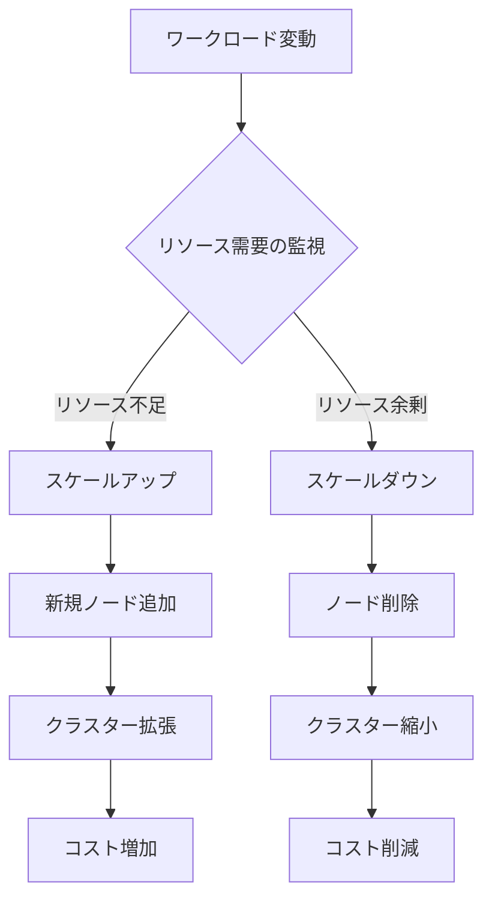

# クラスターオートスケーリング

## 1. クラスターオートスケーリングとは
クラスターオートスケーリングは、Kubernetesクラスターのノード数を自動的に調整する機能です。ワークロードの需要に応じて、ノードを動的に追加・削除することで、リソースの効率的な利用とコスト最適化を実現します。

## 2. なぜ必要なのか

### クラスターオートスケーリングがない場合
- 手動でノード数を調整する必要があり、運用負荷が増大
- リソースの過剰プロビジョニングによる無駄なコスト発生
- 急な負荷増加時にリソース不足でアプリケーションの可用性が低下
- 低負荷時のリソースの無駄遣い

### クラスターオートスケーリングのメリット
- 運用負荷の削減：手動でのスケーリング作業が不要
- コスト最適化：必要な時だけリソースを使用
- 高可用性の確保：急な負荷増加にも自動的に対応
- リソース効率の向上：適切なリソース量を維持

## 3. 重要なポイント

クラスターオートスケーリングは、以下のような課題を解決します：
- 予測困難なワークロード変動への対応
- クラウドリソースのコスト最適化
- 運用自動化による人的ミスの防止
- アプリケーションの可用性とパフォーマンスの維持

## 4. 実際の使い方

### 基本的な設定例
```yaml
apiVersion: autoscaling.k8s.io/v1
kind: ClusterAutoscaler
metadata:
  name: cluster-autoscaler
spec:
  scaleDown:
    enabled: true
    delayAfterAdd: 10m
    delayAfterDelete: 10s
    delayAfterFailure: 3m
  scaleDownUnneededTime: 10m
  maxNodeProvisionTime: 15m
  resourceLimits:
    maxNodesTotal: 10
    cores:
      min: 8
      max: 128
    memory:
      min: 4
      max: 256
```

### 実践的な使用シナリオ
1. 開発環境
   - 平日の業務時間中は十分なリソースを確保
   - 夜間や週末は自動的にスケールダウン

2. バッチ処理環境
   - ジョブ実行時に自動的にスケールアップ
   - 処理完了後にスケールダウン

3. 本番環境
   - トラフィック増加時に自動的にスケールアップ
   - 負荷低下時に段階的にスケールダウン

## 5. 図解による説明



## セキュリティ上の注意点
- スケールダウン時のPodの安全な移行
- ノード削除前のデータの適切な処理
- スケーリング操作の監査ログの取得
- リソース制限の適切な設定

## 参考リンク
- [Kubernetes公式ドキュメント: Autoscaling](https://kubernetes.io/blog/2016/07/autoscaling-in-kubernetes/)
- [Kubernetes Cluster Autoscaler](https://github.com/kubernetes/autoscaler/tree/master/cluster-autoscaler)
