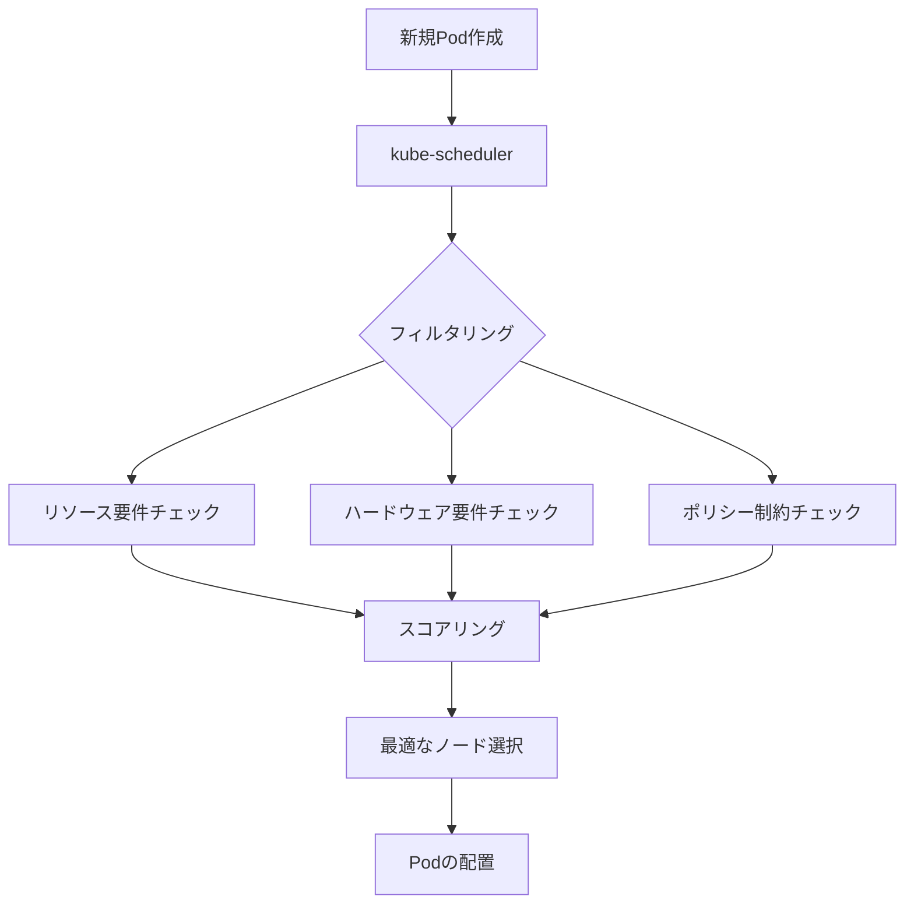
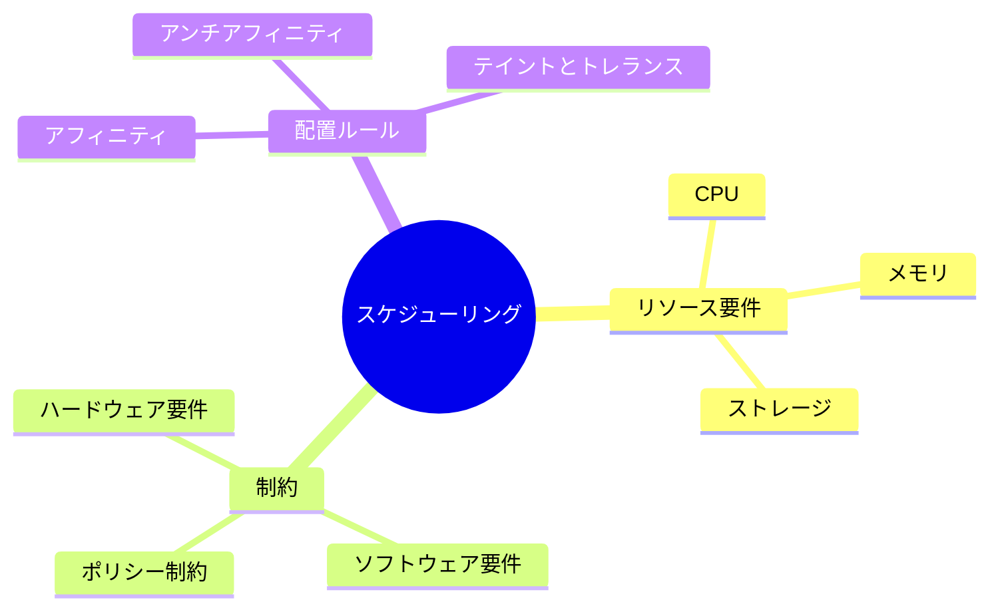

# Kubernetesのスケジューリング基本

## スケジューリングとは
Kubernetesのスケジューリングとは、新しく作成されたPodを最適なノードに割り当てるプロセスです。kube-schedulerがこの重要な役割を担い、クラスター内のリソースを効率的に活用します。

## なぜスケジューリングが必要なのか

### スケジューリングがない場合
- 手動でPodをノードに割り当てる必要があり、運用負荷が増大
- リソースの過不足が発生しやすく、クラスターの効率が低下
- ノードの障害時に自動的な再配置ができない
- ワークロードの特性に応じた最適な配置が困難

### スケジューリングによるメリット
- リソースの効率的な利用が可能
- 高可用性の実現
- ワークロードの特性に応じた柔軟な配置
- 運用の自動化と負荷軽減

## 重要なポイント

### スケジューリングの2段階プロセス
kube-schedulerは以下の2段階で最適なノードを選択します：

1. **フィルタリング（Filtering）**
   - スケジューリング可能なノードを特定
   - リソース要件、ハードウェア要件、ポリシー制約などを考慮

2. **スコアリング（Scoring）**
   - フィルタリングを通過したノードにスコアを付与
   - 最も適切なノードを選択

### スケジューリングの決定要素
- リソース要件（CPU、メモリなど）
- ハードウェア/ソフトウェア制約
- アフィニティ/アンチアフィニティルール
- データの局所性
- ワークロード間の干渉

## 実践的な例

### 基本的なPodのスケジューリング
```yaml
apiVersion: v1
kind: Pod
metadata:
  name: nginx-pod
spec:
  containers:
  - name: nginx
    image: nginx:latest
    resources:
      requests:
        memory: "64Mi"
        cpu: "250m"
      limits:
        memory: "128Mi"
        cpu: "500m"
```

### ノードセレクターを使用したスケジューリング
```yaml
apiVersion: v1
kind: Pod
metadata:
  name: nginx-pod
spec:
  nodeSelector:
    disk: ssd
  containers:
  - name: nginx
    image: nginx:latest
```

## 図解による説明

### スケジューリングの基本フロー


### スケジューリングの決定要素


## セキュリティ面での注意点
- ノードセレクターやアフィニティルールを使用して、セキュリティ要件に合致するノードにのみPodをスケジュール
- リソース制限を適切に設定し、リソースの枯渇を防止
- 機密性の高いワークロードは、専用のノードプールに分離

## 参考リンク
- [Kubernetes公式ドキュメント - kube-scheduler](https://kubernetes.io/docs/concepts/scheduling-eviction/kube-scheduler/)
- [Kubernetesのスケジューリングの仕組み](https://www.youtube.com/watch?v=0FvQR-0tK54)
