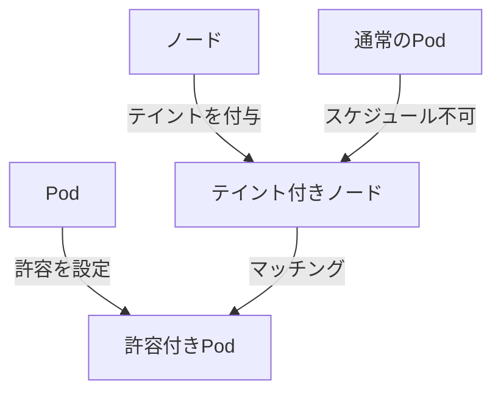
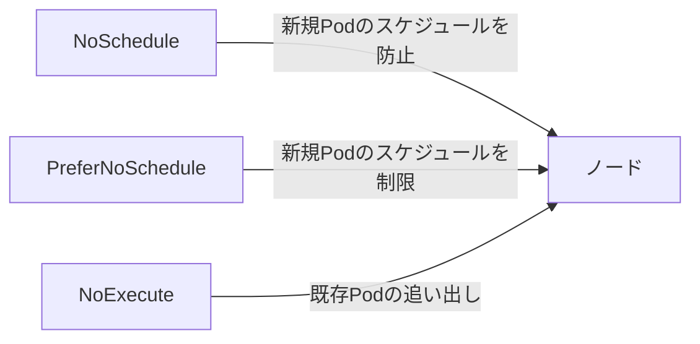
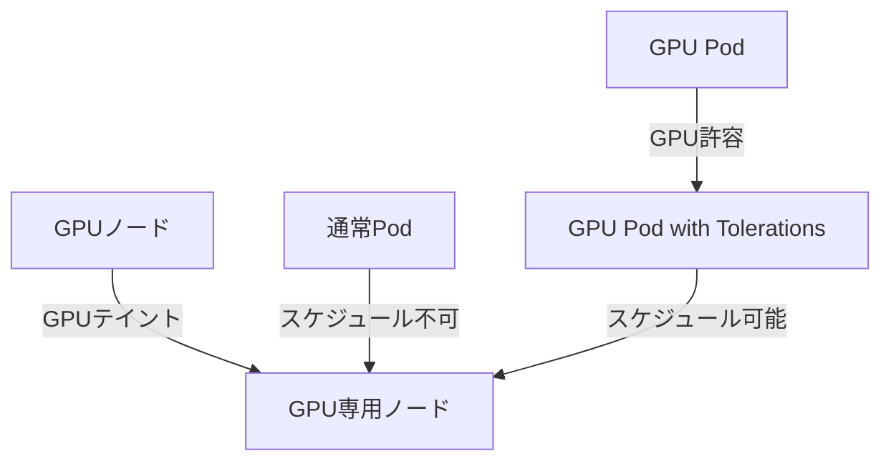

# テイントと許容（Taints and Tolerations）

## 1. トピックの簡単な説明
テイントと許容は、Kubernetesクラスター内で特定のノードにPodをスケジュールするかどうかを制御する仕組みです。テイントはノードに付与される「汚れ」のようなもので、許容はPodが持つ「耐性」のようなものです。

## 2. なぜ必要なのか

### この機能がないとどうなるのか
- ノードの特性や用途に関係なく、すべてのPodが任意のノードにスケジュールされてしまう
- 重要なワークロードと非重要なワークロードが同じノードで混在する可能性がある
- 特定のハードウェアリソース（GPUなど）を必要とするPodが、適切なノードに配置されない可能性がある

### どのような問題が発生するのか
- リソースの競合によるパフォーマンスの低下
- セキュリティ要件の異なるワークロードの混在
- 特殊なハードウェアリソースの非効率な利用
- ノードのメンテナンス時の柔軟性の欠如

### どのようなメリットがあるのか
- ワークロードの分離による安定性の向上
- リソースの効率的な利用
- セキュリティ要件の遵守
- メンテナンス作業の柔軟な実施

## 3. 重要なポイントの解説
テイントと許容は、Kubernetesクラスター内でワークロードの配置を制御する重要な仕組みです。これにより、特定のノードを特定のワークロード専用にすることができ、クラスターの効率性と安定性を向上させることができます。

## 4. 実際の使い方や具体例

### テイントの付与
```bash
# ノードにテイントを付与
kubectl taint nodes node1 key1=value1:NoSchedule
```

### 許容の設定
```yaml
apiVersion: v1
kind: Pod
metadata:
  name: nginx
spec:
  containers:
  - name: nginx
    image: nginx
  tolerations:
  - key: "key1"
    operator: "Equal"
    value: "value1"
    effect: "NoSchedule"
```

## 5. 図解による説明

### テイントと許容の基本概念


### テイントの効果


### 実践的な使用例


## セキュリティ上の注意点
- テイントと許容は、セキュリティの完全な分離を提供するものではありません
- 機密性の高いワークロードには、追加のセキュリティ対策が必要です
- テイントの値は慎重に管理し、適切なアクセス制御を実施してください

## 参考リンク
- [Kubernetes公式ドキュメント - Taints and Tolerations](https://kubernetes.io/docs/concepts/scheduling-eviction/taint-and-toleration/)
- [Kubernetes For Beginners: Taints & Tolerations](https://www.youtube.com/watch?v=mo2UrkjA7FE)
