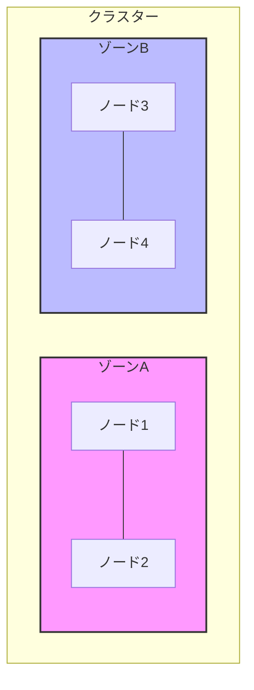
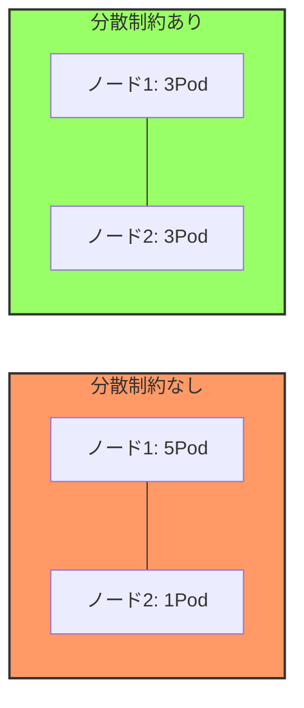

# トポロジー分散制約（Topology Spread Constraints）

## 1. トピックの簡単な説明
トポロジー分散制約は、Kubernetesクラスター内のPodを特定のトポロジードメイン（ノード、ゾーン、ラックなど）に均等に分散させるための機能です。

## 2. なぜ必要なのか

### この機能がないとどうなるのか
- Podが特定のノードやゾーンに偏って配置される可能性があります
- 単一障害点（SPOF）が発生するリスクが高まります
- リソースの不均衡な使用により、パフォーマンスの低下を招く可能性があります

### どのような問題が発生するのか
- 特定のノードやゾーンに負荷が集中し、システムの安定性が損なわれる
- 障害発生時に、アプリケーション全体が影響を受ける可能性が高まる
- リソースの効率的な利用が難しくなる

### どのようなメリットがあるのか
- 高可用性の実現：複数のトポロジードメインに分散することで、単一障害の影響を最小限に抑えられる
- リソースの効率的な利用：クラスター全体でリソースを均等に使用できる
- スケーラビリティの向上：新しいノードやゾーンを追加した際の負荷分散が容易になる

## 3. 重要なポイントの解説
トポロジー分散制約は、アプリケーションの可用性と信頼性を確保するために重要な機能です。特に、本番環境での運用において、予期せぬ障害からアプリケーションを保護し、安定したサービス提供を実現するために不可欠です。

## 4. 実際の使い方や具体例

### 基本的な設定例
```yaml
apiVersion: apps/v1
kind: Deployment
metadata:
  name: my-app
spec:
  replicas: 3
  template:
    spec:
      topologySpreadConstraints:
      - maxSkew: 1
        topologyKey: kubernetes.io/hostname
        whenUnsatisfiable: DoNotSchedule
        labelSelector:
          matchLabels:
            app: my-app
```

### ゾーン間での分散例
```yaml
apiVersion: apps/v1
kind: Deployment
metadata:
  name: my-app
spec:
  replicas: 6
  template:
    spec:
      topologySpreadConstraints:
      - maxSkew: 1
        topologyKey: topology.kubernetes.io/zone
        whenUnsatisfiable: DoNotSchedule
        labelSelector:
          matchLabels:
            app: my-app
```

## 5. 図解による説明

### トポロジー分散制約の概念図


### 分散制約の効果


## 参考リンク
- [公式ドキュメント: Topology Spread Constraints](https://kubernetes.io/docs/concepts/scheduling-eviction/topology-spread-constraints/)
- [Kubernetes | Topology Spread Constraints (動画)](https://www.youtube.com/watch?v=joRrWJ6bwvE)
