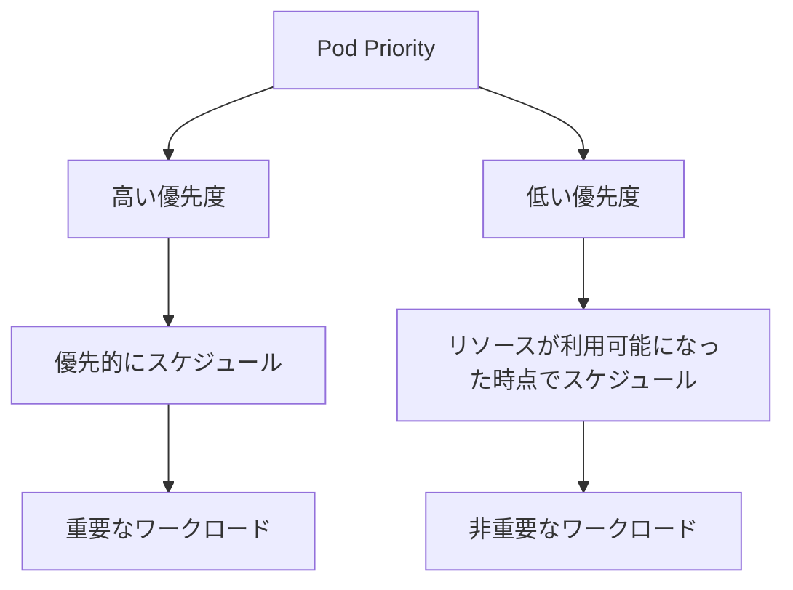
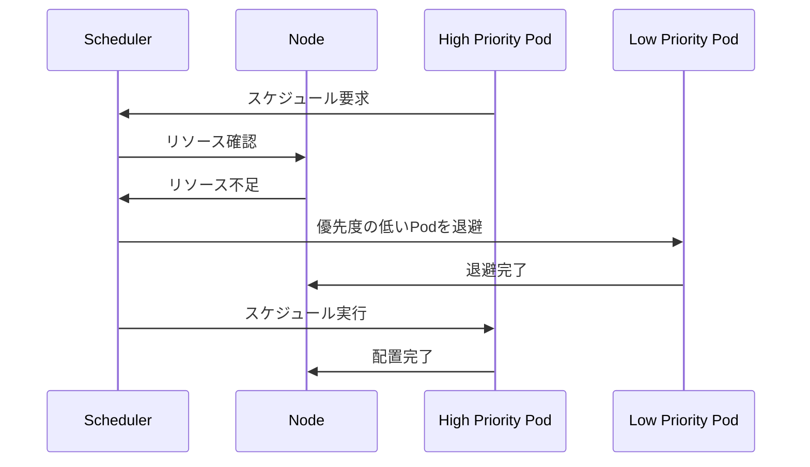

# Pod Priorities（ポッド優先度）

## 1. トピックの簡単な説明
Pod Prioritiesは、Kubernetesクラスター内でリソースの競合が発生した際に、どのPodを優先的にスケジュールするかを決定する仕組みです。

## 2. なぜ必要なのか

### この機能がないとどうなるのか
- リソースが不足した場合、重要なワークロードと非重要なワークロードが同じように扱われてしまう
- システムの重要なコンポーネントが適切なタイミングでスケジュールされない可能性がある
- ビジネスクリティカルなアプリケーションが適切なリソースを確保できない

### どのような問題が発生するのか
- 重要なアプリケーションが非重要なアプリケーションによってリソースを奪われる
- システムの安定性や可用性が低下する
- ビジネス要件に基づいた適切なリソース配分ができない

### どのようなメリットがあるのか
- 重要なワークロードを優先的にスケジュールできる
- ビジネス要件に基づいた柔軟なリソース管理が可能
- システムの安定性と可用性の向上
- クラスターリソースの効率的な利用

## 3. 重要なポイントの解説
Pod Prioritiesは、Kubernetesクラスター内でリソースの競合が発生した際に、ビジネス要件やアプリケーションの重要度に基づいて適切なリソース配分を実現するための重要な機能です。これにより、システムの安定性と可用性を確保しながら、効率的なリソース管理が可能になります。

## 4. 実際の使い方や具体例

### PriorityClassの定義
```yaml
apiVersion: scheduling.k8s.io/v1
kind: PriorityClass
name: high-priority
value: 1000000
globalDefault: false
description: "This priority class should be used for high priority pods."
```

### Podでの優先度の設定
```yaml
apiVersion: v1
kind: Pod
metadata:
  name: high-priority-pod
spec:
  containers:
  - name: nginx
    image: nginx
  priorityClassName: high-priority
```

## 5. 図解による説明

### Pod Prioritiesの基本概念


### リソース競合時の動作


## セキュリティ面での注意点
- 優先度の設定は慎重に行う必要がある
- 過度に高い優先度の設定は、他の重要なワークロードに影響を与える可能性がある
- 優先度の設定は適切なアクセス制御のもとで管理する

## 参考リンク
- [Kubernetes公式ドキュメント - Pod Priority and Preemption](https://kubernetes.io/docs/concepts/scheduling-eviction/pod-priority-preemption/#pod-priority)
- [Kubernetes Pod Priority (Examples)](https://www.youtube.com/watch?v=sR_Zmvme3-0)
