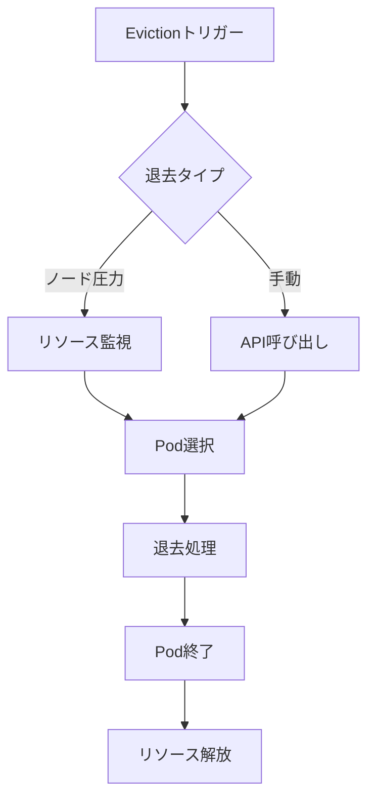
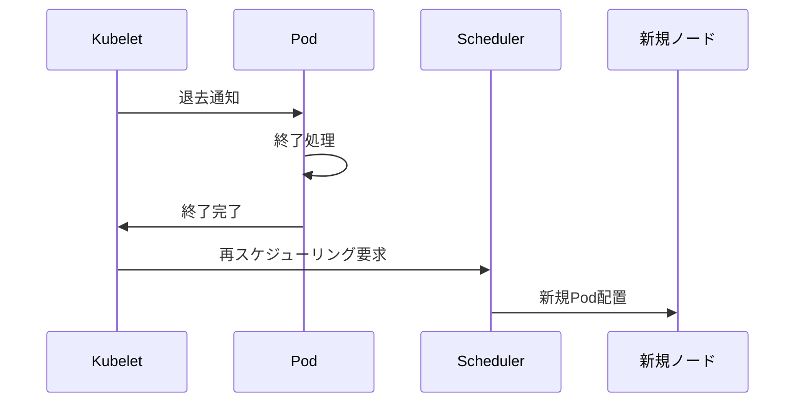

# Kubernetes Evictions（退去）

## 1. トピックの簡単な説明
Kubernetes Evictions（退去）は、ノード上のPodを強制的に終了させるメカニズムです。リソース不足やノードのメンテナンス時など、様々な状況でPodを安全に退去させるために使用されます。

## 2. なぜ必要なのか

### この機能がないとどうなるのか
- リソース不足時にノードが不安定になる
- メンテナンス作業が困難になる
- クラスターの健全性が損なわれる

### どのような問題が発生するのか
- ノードのリソース枯渇によるクラッシュ
- サービス品質の低下
- メンテナンス時のダウンタイム増加

### どのようなメリットがあるのか
- クラスターの安定性確保
- リソースの効率的な管理
- 計画的なメンテナンスの実現
- サービスの可用性向上

## 3. 重要なポイントの解説
Evictionsは、クラスターの健全性を維持するための重要なメカニズムです。リソース不足やメンテナンス時に、Podを安全かつ制御された方法で終了させることで、サービスの可用性を確保しつつ、クラスターの安定性を維持することができます。

## 4. 実際の使い方や具体例

### ノード圧力による退去
```yaml
# kubeletの設定例
evictionHard:
  memory.available: "100Mi"
  nodefs.available: "10%"
  nodefs.inodesFree: "5%"
```

### APIによる手動退去
```bash
# Podの退去を実行
kubectl drain <node-name>

# 特定のPodを退去
kubectl evict <pod-name> --grace-period=30
```

## 5. 図解による説明

### Evictionsの基本フロー


### 退去プロセスの詳細


## セキュリティ面での注意点
- 退去処理は適切な権限を持つユーザーのみが実行可能
- 重要なPodには適切な優先度（Priority）を設定
- PodDisruptionBudgetを使用して可用性を確保

## 参考リンク
- [Node-pressure Eviction](https://kubernetes.io/docs/concepts/scheduling-eviction/node-pressure-eviction/)
- [API-initiated Eviction](https://kubernetes.io/docs/concepts/scheduling-eviction/api-eviction/)
