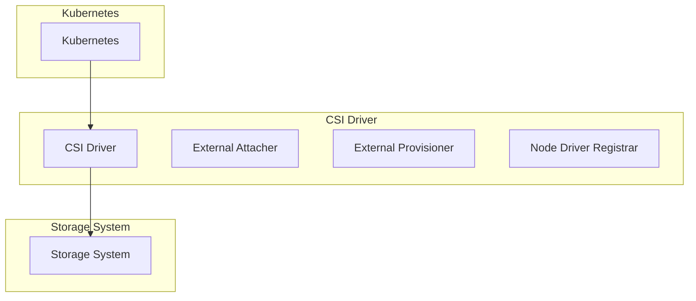
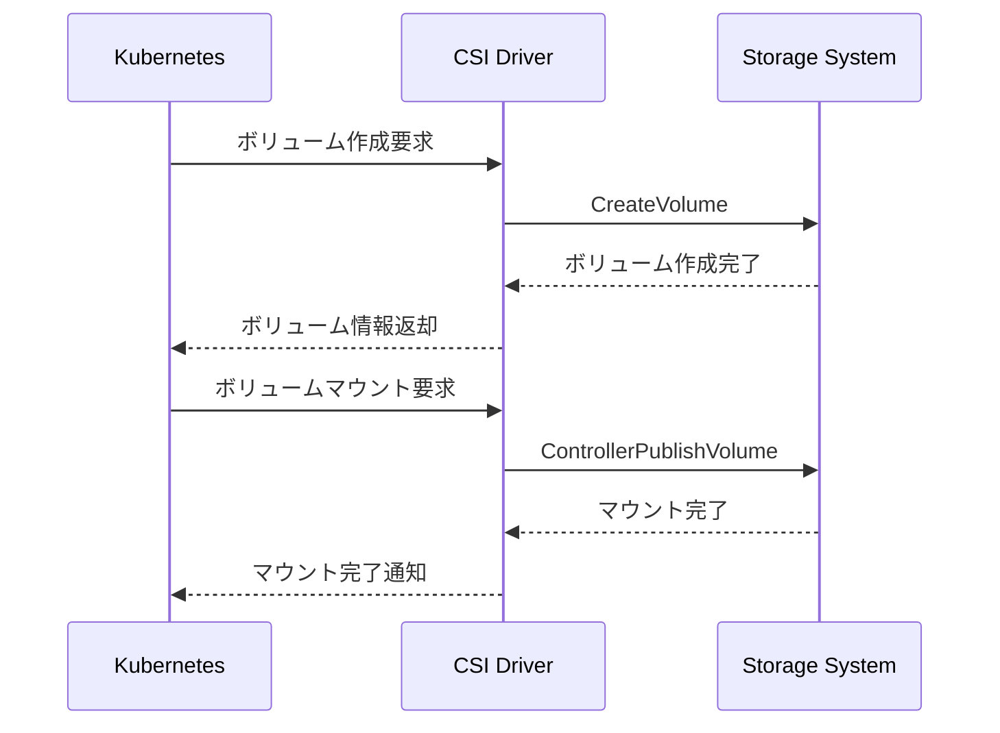

# CSIドライバ（Container Storage Interface Driver）

## 1. トピックの簡単な説明
CSIドライバは、Kubernetesクラスターで様々なストレージシステムを統一的に利用できるようにするための標準インターフェースを提供する仕組みです。

## 2. なぜ必要なのか

### この機能がないとどうなるのか
- ストレージベンダーごとに異なる実装が必要になり、Kubernetesのコードベースが複雑化
- 新しいストレージシステムの追加に時間がかかる
- ストレージ機能の拡張が困難

### どのような問題が発生するのか
- ストレージベンダーが独自の実装を提供する必要がある
- Kubernetesのバージョンアップに追従する必要がある
- ストレージ機能の一貫性が保てない

### どのようなメリットがあるのか
- ストレージベンダーがKubernetesのコードベースを変更せずに機能を提供可能
- 新しいストレージシステムの追加が容易
- スナップショットやクローンなどの高度な機能を標準的に利用可能
- ストレージの実装とKubernetesの分離による保守性の向上

## 3. 重要なポイントの解説
CSIドライバは、Kubernetesとストレージシステムの間の標準インターフェースを提供することで、ストレージの実装を柔軟にし、機能拡張を容易にします。これにより、様々なストレージシステムを統一的に管理できるようになります。

## 4. 実際の使い方や具体例

### CSIドライバのデプロイ
```yaml
apiVersion: storage.k8s.io/v1
kind: StorageClass
metadata:
  name: fast-storage
provisioner: csi-driver.example.com
parameters:
  type: pd-ssd
```

### 永続ボリュームの要求
```yaml
apiVersion: v1
kind: PersistentVolumeClaim
metadata:
  name: my-request-for-storage
spec:
  accessModes:
    - ReadWriteOnce
  resources:
    requests:
      storage: 5Gi
  storageClassName: fast-storage
```

## 5. 図解による説明

### CSIドライバのアーキテクチャ


### CSIドライバの動作フロー


## セキュリティ上の注意点
- CSIドライバは特権コンテナとして実行される必要がある
- 適切なRBAC設定が必要
- ストレージシステムへの認証情報はSecretとして管理

## 参考リンク
- [Container Storage Interface (CSI) for Kubernetes](https://kubernetes.io/blog/2019/01/15/container-storage-interface-ga/)
- [CSI in Kubernetes](https://www.youtube.com/watch?v=brXPQ1Qwjl4)
