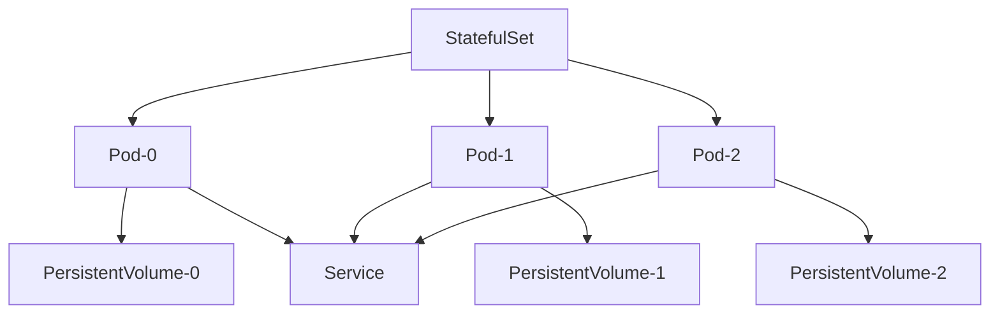
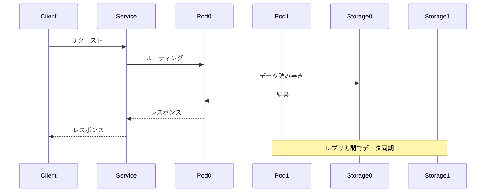

# ステートフルアプリケーション（Stateful Applications）

## 1. トピックの簡単な説明
ステートフルアプリケーションとは、データの永続性が必要なアプリケーションのことです。データベースやメッセージングシステムなど、アプリケーションの状態（データ）を保持する必要がある場合に使用されます。

## 2. なぜ必要なのか

### この機能がないとどうなるのか
- アプリケーションの再起動時にデータが失われる
- 複数のレプリカ間でデータの一貫性が保てない
- スケーリング時にデータの整合性が崩れる

### どのような問題が発生するのか
- データの永続性が確保できない
- レプリカ間でのデータ同期が困難
- アプリケーションの可用性が低下
- データの整合性が保てない

### どのようなメリットがあるのか
- データの永続性が確保できる
- レプリカ間でのデータ同期が容易
- スケーリング時のデータ整合性が保証される
- アプリケーションの可用性が向上

## 3. 重要なポイントの解説
ステートフルアプリケーションは、データの永続性と一貫性を保証することで、信頼性の高いサービスを提供するために重要です。特に、データベースやメッセージングシステムなど、データの整合性が重要なアプリケーションでは必須の機能となります。

## 4. 実際の使い方や具体例

### StatefulSetの定義例
```yaml
apiVersion: apps/v1
kind: StatefulSet
metadata:
  name: mysql
spec:
  serviceName: mysql
  replicas: 3
  selector:
    matchLabels:
      app: mysql
  template:
    metadata:
      labels:
        app: mysql
    spec:
      containers:
      - name: mysql
        image: mysql:5.7
        ports:
        - containerPort: 3306
        volumeMounts:
        - name: data
          mountPath: /var/lib/mysql
  volumeClaimTemplates:
  - metadata:
      name: data
    spec:
      accessModes: [ "ReadWriteOnce" ]
      resources:
        requests:
          storage: 10Gi
```

## 5. 図解による説明

### ステートフルアプリケーションの基本構造


### ステートフルアプリケーションのデータフロー


## セキュリティ面での注意点
- 永続ボリュームへのアクセス制御を適切に設定する
- 機密データの暗号化を検討する
- バックアップとリストアの仕組みを整備する
- ネットワークポリシーでアクセスを制限する

## 参考リソース
- [Kubernetes公式ドキュメント - Stateful Applications](https://kubernetes.io/docs/tutorials/stateful-application/)
- [Kubernetes StatefulSetの基本](https://www.youtube.com/watch?v=GieXzb91I40)
