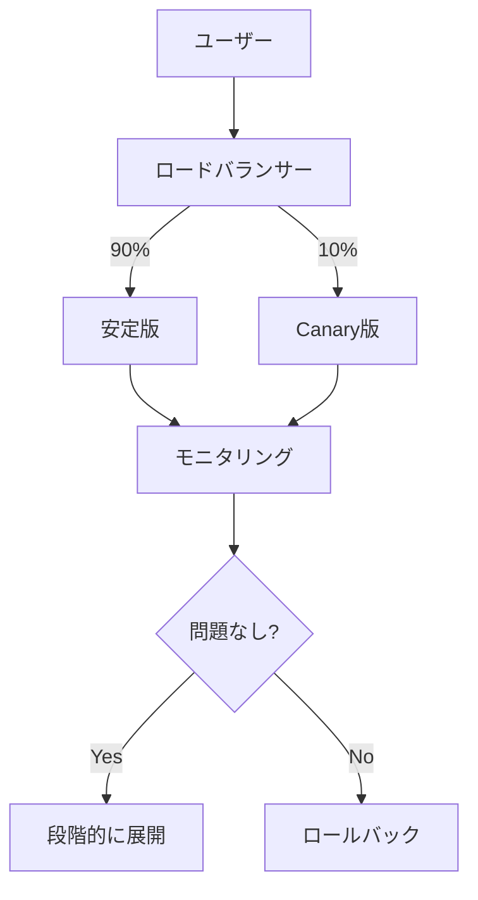
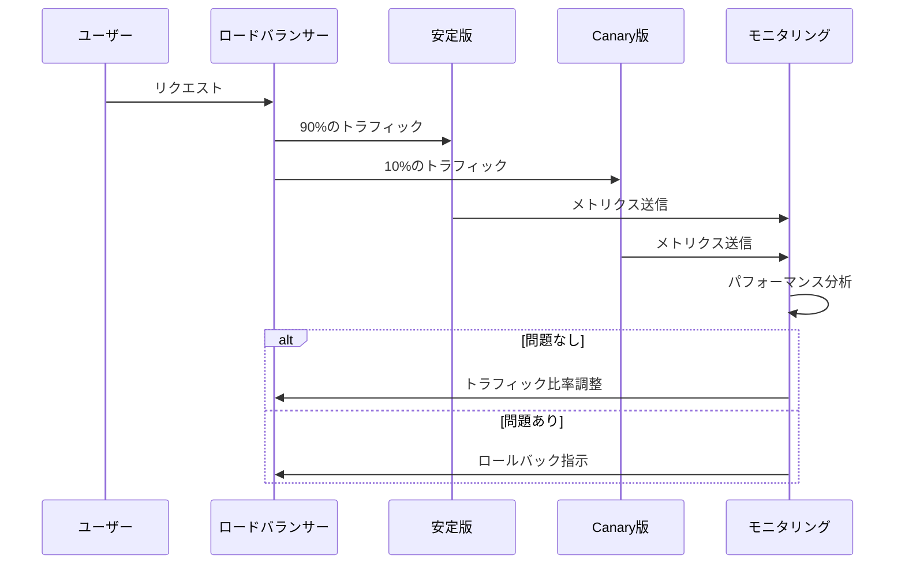

# Canaryデプロイメント

## 1. トピックの簡単な説明
Canaryデプロイメントは、新しいバージョンのアプリケーションを段階的に展開する手法で、一部のユーザーやトラフィックのみを新バージョンに振り分け、残りは従来のバージョンを継続して使用します。

## 2. なぜ必要なのか

### この機能がないとどうなるのか
- 新バージョンのデプロイ時に全ユーザーが影響を受ける
- 問題が発生した場合、全ユーザーに影響が及ぶ
- ロールバックに時間がかかり、サービス停止時間が長くなる

### どのような問題が発生するのか
- 予期せぬバグや問題が全ユーザーに影響
- システム全体の安定性が損なわれる
- 問題の早期発見が困難

### どのようなメリットがあるのか
- リスクを最小限に抑えながら新機能をテスト可能
- 問題発生時の影響範囲を限定できる
- 段階的なロールアウトによる安全な更新
- ユーザーフィードバックを収集しながら改善可能

## 3. 重要なポイントの解説
Canaryデプロイメントは、本番環境での新機能の安全性を確保しながら、段階的に展開できる重要な手法です。特に大規模なシステムや重要なサービスにおいて、リスク管理と安定性を両立させるために不可欠です。

## 4. 実際の使い方や具体例

### Kubernetesでの実装例
```yaml
apiVersion: apps/v1
kind: Deployment
metadata:
  name: myapp-canary
spec:
  replicas: 1
  selector:
    matchLabels:
      app: myapp
  template:
    metadata:
      labels:
        app: myapp
        version: canary
    spec:
      containers:
      - name: myapp
        image: myapp:new-version
```

### トラフィック分割の例（Istio使用）
```yaml
apiVersion: networking.istio.io/v1alpha3
kind: VirtualService
metadata:
  name: myapp
spec:
  hosts:
  - myapp
  http:
  - route:
    - destination:
        host: myapp
        subset: stable
      weight: 90
    - destination:
        host: myapp
        subset: canary
      weight: 10
```

## 5. 図解による説明

### Canaryデプロイメントの基本概念


### 段階的な展開プロセス


## セキュリティ面での注意点
- 新バージョンのセキュリティテストを事前に実施
- 機密データの取り扱いに注意
- アクセス制御の適切な設定
- 監視とログ収集の徹底

## 参考リソース
- [Microsoft Learn: Canary deployment for K8s deployments](https://learn.microsoft.com/en-us/azure/devops/pipelines/ecosystems/kubernetes/canary-demo?view=azure-devops&tabs=yaml)
- [Kubernetes canary deployments Explained](https://www.youtube.com/watch?v=sCevTD_GtvU)
