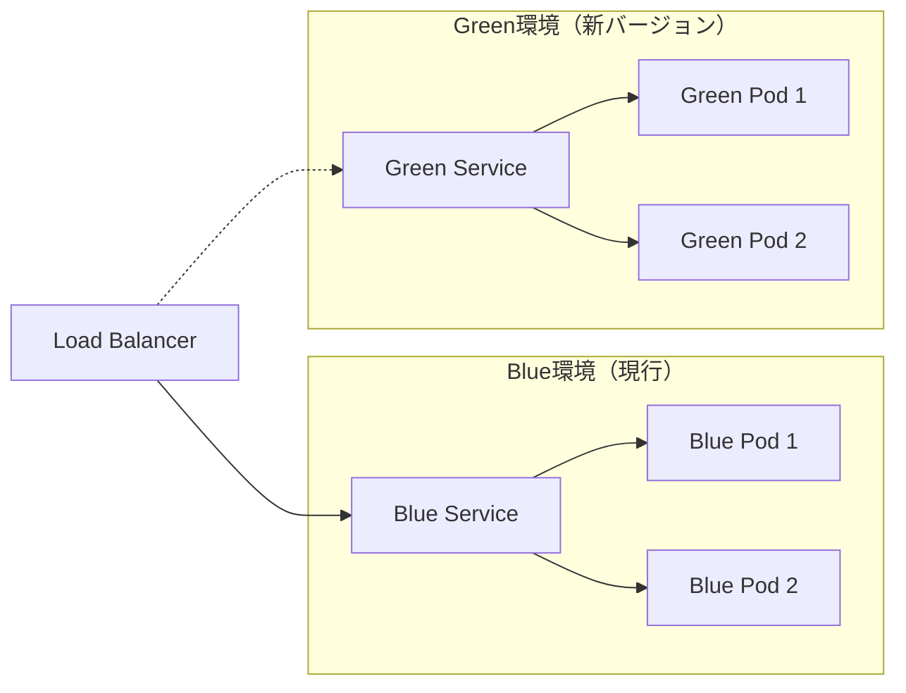
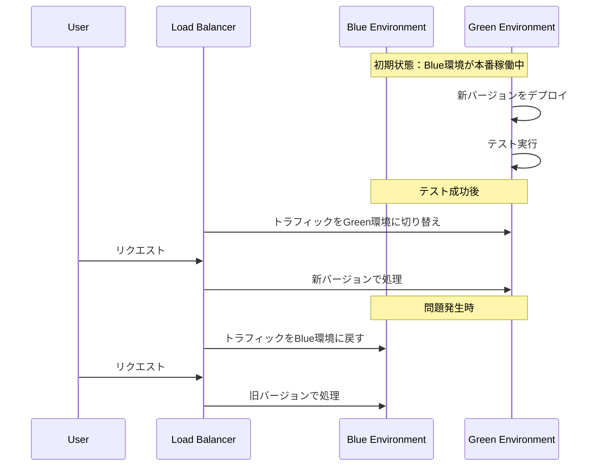

# Blue-Greenデプロイメント

## 1. トピックの簡単な説明
Blue-Greenデプロイメントは、アプリケーションの新バージョンを安全にリリースするためのデプロイメント戦略で、現在の本番環境（Blue）と新しいバージョンの環境（Green）を並行して運用し、切り替えを行う手法です。

## 2. なぜ必要なのか

### この機能がないとどうなるのか
- アプリケーションの更新時にダウンタイムが発生する
- ロールバックが困難で時間がかかる
- 新バージョンに問題があった場合、ユーザーに直接影響が出る

### どのような問題が発生するのか
- サービス停止によるユーザー体験の低下
- 問題発生時の復旧に時間がかかる
- 新機能のテストが本番環境で直接行われる

### どのようなメリットがあるのか
- ゼロダウンタイムでのデプロイメントが可能
- 即時のロールバックが可能
- 新バージョンの事前テストが可能
- ユーザーへの影響を最小限に抑えられる

## 3. 重要なポイントの解説
Blue-Greenデプロイメントの最大の利点は、リスクを最小限に抑えながら、アプリケーションの更新を安全に行えることです。問題が発生した場合でも、即座に前のバージョンに戻すことができ、ユーザーへの影響を最小限に抑えることができます。

## 4. 実際の使い方や具体例

### Kubernetesでの実装例
```yaml
# Blue環境のService
apiVersion: v1
kind: Service
metadata:
  name: myapp-blue
  labels:
    app: myapp
    color: blue
spec:
  ports:
  - port: 80
    targetPort: 8080
  selector:
    app: myapp
    color: blue
---
# Green環境のService
apiVersion: v1
kind: Service
metadata:
  name: myapp-green
  labels:
    app: myapp
    color: green
spec:
  ports:
  - port: 80
    targetPort: 8080
  selector:
    app: myapp
    color: green
```

## 5. 図解による説明

### Blue-Greenデプロイメントの基本概念


### デプロイメントの流れ


## セキュリティ面での注意点
- 環境変数やシークレットの適切な管理
- 各環境へのアクセス制御の設定
- トラフィック切り替え時の認証・認可の継続性確保

## 参考リンク
- [Harness - Create a Kubernetes Blue Green Deployment](https://developer.harness.io/docs/continuous-delivery/cd-execution/kubernetes-executions/create-a-kubernetes-blue-green-deployment/)
- [Kubernetes - Blue/Green Deployments](https://www.youtube.com/watch?v=jxhpTGQ484Y)
