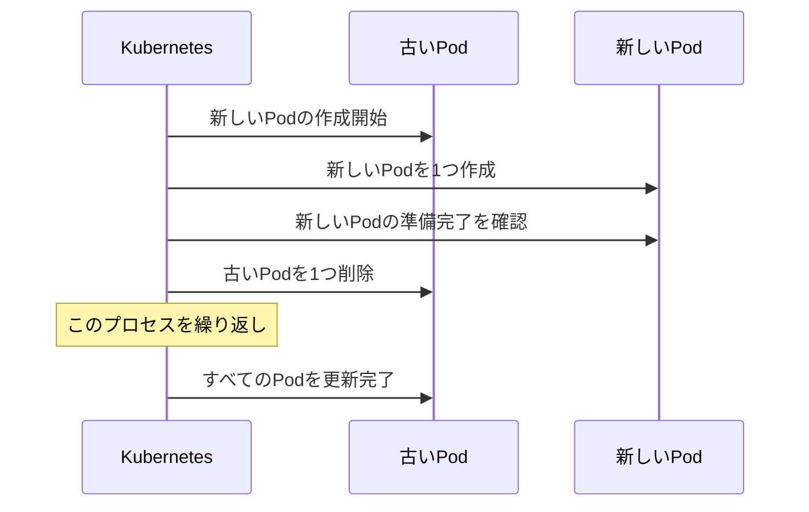
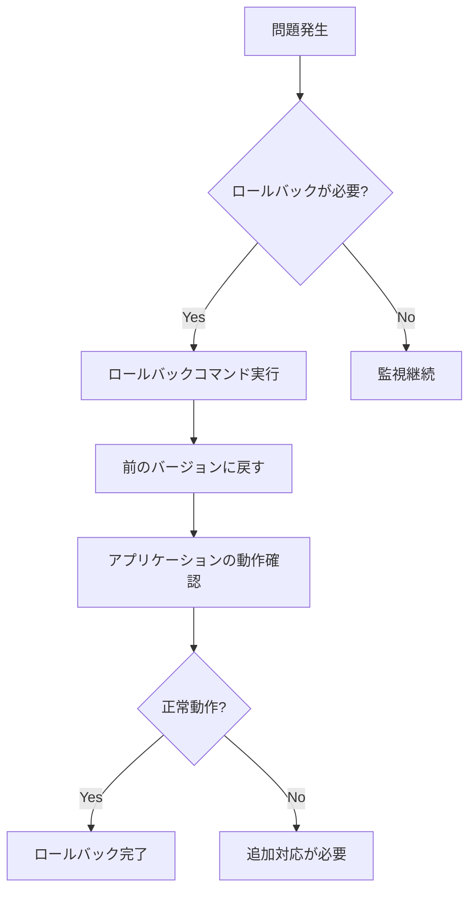

# ローリングアップデートとロールバック

## 1. トピックの簡単な説明
ローリングアップデートは、アプリケーションの新しいバージョンを段階的にデプロイする手法で、サービスを停止することなく安全に更新を行うことができます。ロールバックは、問題が発生した場合に前のバージョンに戻す機能です。

## 2. なぜ必要なのか

### この機能がないとどうなるのか
- アプリケーションの更新時にサービスが完全に停止する
- ユーザーが一時的にサービスを利用できなくなる
- 更新に失敗した場合、手動で復旧する必要がある

### どのような問題が発生するのか
- ダウンタイムによるビジネスへの影響
- 更新失敗時の復旧に時間がかかる
- 手動での更新作業によるヒューマンエラーのリスク

### どのようなメリットがあるのか
- サービスを継続的に利用可能な状態を維持
- 更新の進捗状況をリアルタイムで監視可能
- 問題発生時に素早く前のバージョンに戻せる
- 更新プロセスを自動化し、人的ミスを防止

## 3. 重要なポイントの解説
ローリングアップデートとロールバックは、本番環境での安全なアプリケーション更新を実現するための重要な機能です。特に、24時間365日稼働が必要なシステムにおいて、ダウンタイムを最小限に抑えながら、確実に更新を行うことができます。

## 4. 実際の使い方や具体例

### ローリングアップデートの設定例
```yaml
apiVersion: apps/v1
kind: Deployment
metadata:
  name: nginx-deployment
spec:
  replicas: 3
  strategy:
    type: RollingUpdate
    rollingUpdate:
      maxSurge: 1        # 最大で何個のPodを追加できるか
      maxUnavailable: 0  # 更新中に利用できないPodの最大数
  template:
    spec:
      containers:
      - name: nginx
        image: nginx:1.14.2
```

### ロールバックの実行方法
```bash
# デプロイメントの履歴を確認
kubectl rollout history deployment/nginx-deployment

# 特定のリビジョンにロールバック
kubectl rollout undo deployment/nginx-deployment --to-revision=2
```

## 5. 図解による説明

### ローリングアップデートの流れ


### ロールバックの流れ


## セキュリティ面での注意点
- 更新前のバックアップを必ず取得する
- ロールバック手順を事前にテストしておく
- 更新時の監視体制を整えておく
- 更新のタイミングは業務時間外を検討する

## 参考リンク
- [Kubernetes公式ドキュメント - デプロイメントのロールバック](https://kubernetes.io/docs/concepts/workloads/controllers/deployment/#rolling-back-a-deployment)
