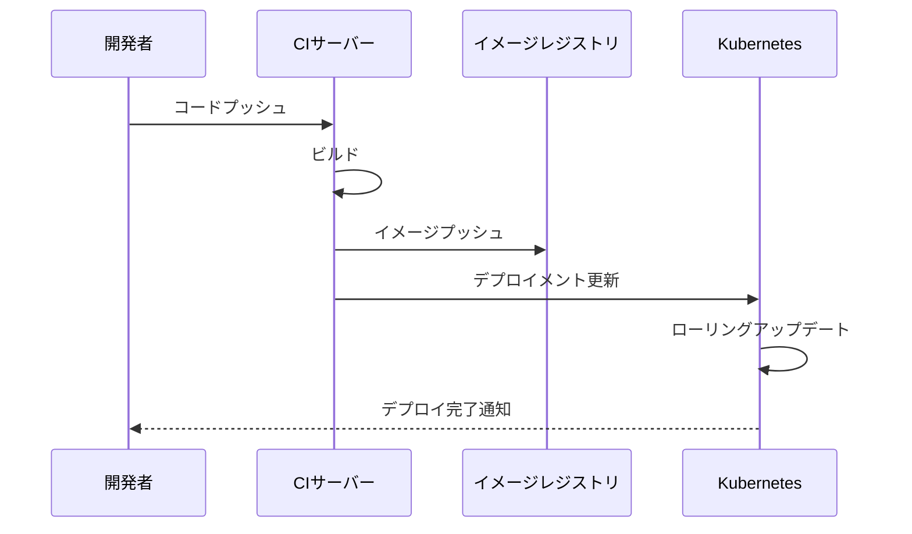

# CI/CD統合

## 1. トピックの簡単な説明
CI/CD統合とは、アプリケーションの開発からデプロイまでの一連のプロセスを自動化し、継続的に統合・配信・デプロイを行う仕組みのことです。

## 2. なぜ必要なのか

### CI/CDがない場合の問題点
- 手動でのビルド・テスト・デプロイに時間がかかる
- 人為的ミスが発生しやすい
- 開発から本番環境への反映に時間がかかる
- 品質のばらつきが生じる
- チーム間の連携が非効率

### CI/CDを導入するメリット
- 開発からデプロイまでの時間短縮
- 品質の安定化
- 人的ミスの削減
- チームの生産性向上
- 迅速なフィードバックループの実現

## 3. 重要なポイントの解説
CI/CDパイプラインは、コードの変更から本番環境へのデプロイまでを自動化することで、開発の効率化と品質向上を実現します。特にKubernetes環境では、コンテナイメージのビルド、テスト、デプロイの一連の流れを自動化することで、安全かつ迅速なアプリケーションの更新が可能になります。

## 4. 実際の使い方や具体例

### 基本的なCI/CDパイプラインの構成
```yaml
# .gitlab-ci.yml の例
stages:
  - build
  - test
  - deploy

build:
  stage: build
  script:
    - docker build -t myapp:$CI_COMMIT_SHA .
    - docker push myapp:$CI_COMMIT_SHA

test:
  stage: test
  script:
    - kubectl apply -f k8s/test/
    - ./run-tests.sh

deploy:
  stage: deploy
  script:
    - kubectl set image deployment/myapp myapp=myapp:$CI_COMMIT_SHA
```

### セキュリティ上の注意点
- コンテナレジストリへのアクセス制御
- シークレット情報の適切な管理
- イメージのスキャンと脆弱性チェック
- デプロイメントの承認プロセスの実装

## 5. 図解による説明

### CI/CDパイプラインの基本フロー


### デプロイメントプロセス


## 参考リソース
- [Kubernetes公式ドキュメント](https://kubernetes.io/docs/concepts/workloads/controllers/deployment/)
- [Jenkins公式ドキュメント](https://www.jenkins.io/doc/)
- [GitLab CI/CDドキュメント](https://docs.gitlab.com/ee/ci/)
