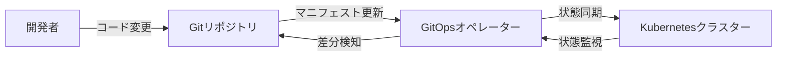
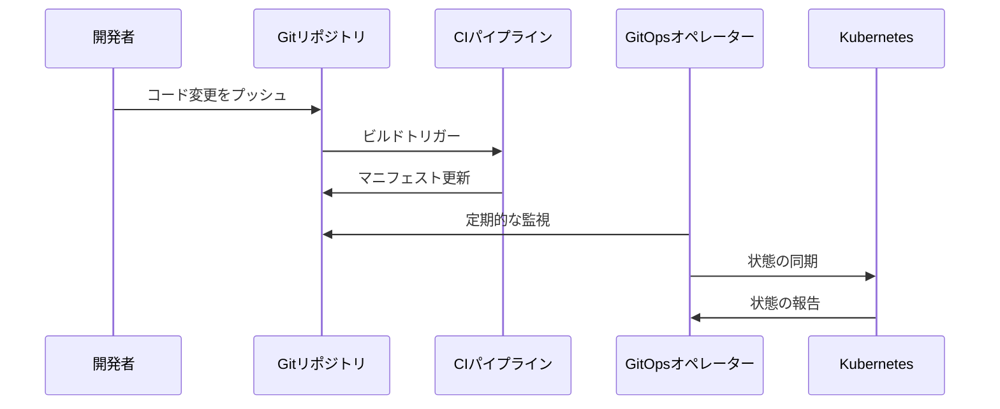

# GitOps

## 1. トピックの簡単な説明
GitOpsは、インフラストラクチャとアプリケーションの管理を、Gitリポジトリを「信頼できる唯一の情報源（Single Source of Truth）」として使用する手法です。Kubernetes環境において、システムの望ましい状態と実際の状態をGitで管理し、デプロイメントと管理タスクを自動化します。

## 2. なぜ必要なのか

### この機能がないとどうなるのか
- 手動での設定変更が増え、ヒューマンエラーのリスクが高まる
- 環境間の設定の不一致が発生しやすい
- 変更履歴の追跡が困難になる
- ロールバックが複雑になる

### どのような問題が発生するのか
- 本番環境と開発環境の差異による予期せぬ問題
- 設定変更の承認プロセスが不明確
- トラブルシューティング時の原因特定が困難
- セキュリティ設定の一貫性が保てない

### どのようなメリットがあるのか
- インフラストラクチャの変更履歴が明確に追跡可能
- 自動化によるデプロイメントの信頼性向上
- 環境間の一貫性が保証される
- セキュリティとコンプライアンスの強化
- チーム間のコラボレーションが改善

## 3. 重要なポイントの解説
GitOpsの本質は「宣言的」な管理と「自動化」にあります。インフラストラクチャの状態をコードとして管理することで、バージョン管理、レビュー、テストが可能になり、より安全で信頼性の高い運用が実現できます。

## 4. 実際の使い方や具体例

### 基本的なワークフロー
1. 開発者がアプリケーションコードを変更
2. CIパイプラインが新しいコンテナイメージをビルド
3. マニフェストファイルをGitリポジトリにプッシュ
4. GitOpsオペレーターが変更を検知
5. クラスターの状態を自動的に更新

### 実装例
```yaml
# GitOpsオペレーターの設定例
apiVersion: source.toolkit.fluxcd.io/v1beta2
kind: GitRepository
metadata:
  name: my-app
  namespace: flux-system
spec:
  interval: 1m
  url: https://github.com/org/my-app
  ref:
    branch: main
```

## 5. 図解による説明

### GitOpsの基本アーキテクチャ


### デプロイメントフロー


## セキュリティ面での注意点
- シークレット管理には専用のツール（Sealed Secrets等）を使用
- アクセス権限の適切な設定
- マニフェストのセキュリティスキャン
- 変更履歴の監査ログの保持

## 参考リソース
- [GitLab GitOps ドキュメント](https://docs.gitlab.com/ee/user/clusters/agent/gitops.html)
- [Kubernetes GitOps チュートリアル](https://www.youtube.com/watch?v=PFLimPh5-wo)
- [GitOps ベストプラクティス](https://app.daily.dev/tags/gitops?ref=roadmapsh)
