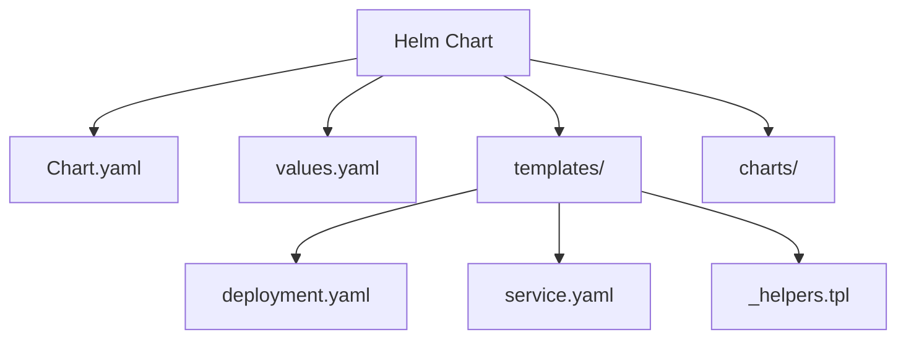
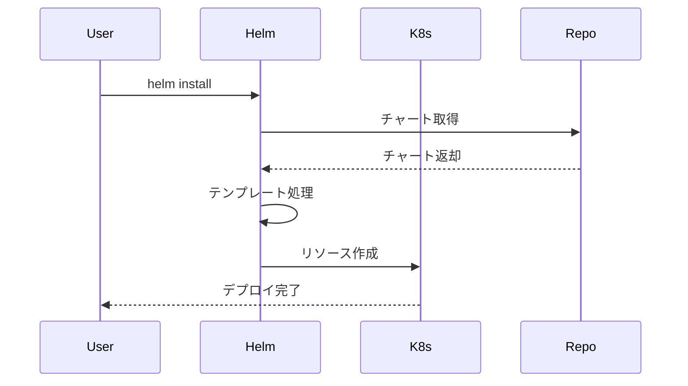
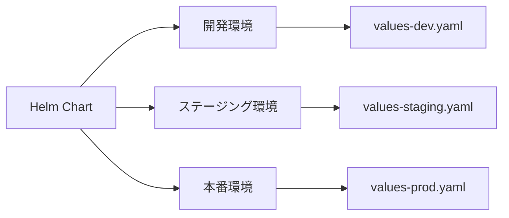

# Helmチャート

## 1. トピックの簡単な説明
Helmチャートは、Kubernetesアプリケーションのパッケージングとデプロイメントを簡素化するためのテンプレート集です。アプリケーションの構成要素を再利用可能な形で管理し、バージョン管理することができます。

## 2. なぜ必要なのか

### この機能がないとどうなるのか
- アプリケーションのデプロイメント時に、多数のYAMLファイルを手動で管理する必要がある
- 環境ごとの設定変更が煩雑になり、ミスが発生しやすい
- アプリケーションの構成管理が困難になる

### どのような問題が発生するのか
- デプロイメントの一貫性が保てない
- 環境間の差分管理が複雑になる
- アプリケーションの更新やロールバックが手作業になり、時間がかかる
- チーム間での設定共有が困難

### どのようなメリットがあるのか
- アプリケーションのデプロイメントを標準化できる
- テンプレート化により、環境ごとの設定変更が容易
- バージョン管理により、安全な更新とロールバックが可能
- 再利用可能なチャートにより、開発効率が向上

## 3. 重要なポイントの解説
Helmチャートは、Kubernetesリソースの管理を「パッケージ化」することで、アプリケーションのデプロイメントを標準化し、運用負荷を大幅に軽減します。特に複数の環境（開発・ステージング・本番）で同じアプリケーションを管理する場合に、その真価を発揮します。

## 4. 実際の使い方や具体例

### 基本的な使い方
```bash
# チャートのインストール
helm install my-app ./my-chart

# チャートのアップグレード
helm upgrade my-app ./my-chart

# チャートのアンインストール
helm uninstall my-app
```

### チャートの構造
```
my-chart/
├── Chart.yaml          # チャートのメタデータ
├── values.yaml         # デフォルトの設定値
├── templates/          # テンプレートファイル
│   ├── deployment.yaml
│   ├── service.yaml
│   └── _helpers.tpl
└── charts/            # 依存チャート
```

## 5. 図解による説明

### Helmチャートの基本構造


### Helmのデプロイメントフロー


### 環境別の設定管理


## セキュリティ面での注意点
- チャートの署名検証を行う
- 信頼できるリポジトリからのチャートのみを使用
- 機密情報はKubernetes Secretsで管理
- 最小権限の原則に従った設定

## 参考リンク
- [公式Helmドキュメント](https://helm.sh/docs/)
- [Helm Hub](https://hub.helm.sh/)
