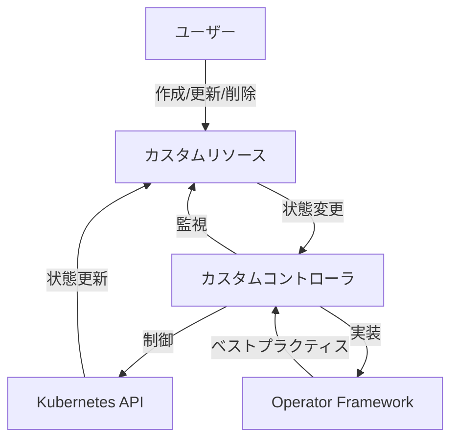
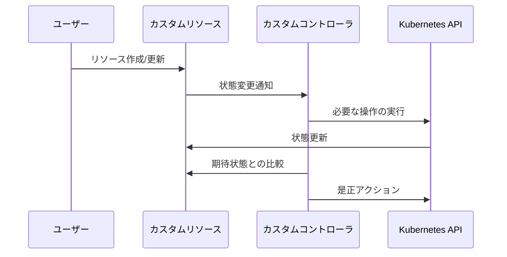

# カスタムコントローラの作成

## 1. トピックの簡単な説明
カスタムコントローラは、Kubernetesのネイティブでサポートされていないリソースを自動的に管理するための仕組みです。組織固有の要件に合わせてKubernetes APIを拡張し、そのリソースの状態変化を監視・制御します。

## 2. なぜ必要なのか

### この機能がないとどうなるのか
- 組織固有のリソース管理を手動で行う必要がある
- 複雑な運用タスクの自動化ができない
- 一貫性のある管理が困難になる

### どのような問題が発生するのか
- 人的ミスのリスクが高まる
- 運用コストが増加する
- スケーラビリティに制限が生じる
- 標準化された管理が難しい

### どのようなメリットがあるのか
- 運用の自動化による効率化
- 人的ミスの削減
- 一貫性のある管理の実現
- 組織固有の要件への柔軟な対応
- 運用コストの削減

## 3. 重要なポイントの解説
カスタムコントローラは、組織固有の要件をKubernetesの管理システムに統合するための重要な仕組みです。これにより、標準的なKubernetesリソースと同じように、組織固有のリソースも宣言的に管理できるようになります。

## 4. 実際の使い方や具体例

### 基本的な実装手順
1. CustomResourceDefinition (CRD) の作成
2. カスタムコントローラの実装
3. デプロイと設定

```yaml
# CustomResourceDefinitionの例
apiVersion: apiextensions.k8s.io/v1
kind: CustomResourceDefinition
metadata:
  name: applications.example.com
spec:
  group: example.com
  versions:
    - name: v1
      served: true
      storage: true
      schema:
        openAPIV3Schema:
          type: object
          properties:
            spec:
              type: object
              properties:
                replicas:
                  type: integer
                image:
                  type: string
  scope: Namespaced
  names:
    plural: applications
    singular: application
    kind: Application
```

## 5. 図解による説明





## セキュリティ面での注意点
- カスタムコントローラの権限は必要最小限に設定する
- リソースのバリデーションを適切に実装する
- 認証・認可の仕組みを適切に設定する
- 監査ログを有効化する

## 参考リンク
- [Kubernetes公式ドキュメント - Custom Controllers](https://kubernetes.io/docs/concepts/extend-kubernetes/api-extension/custom-resources/#custom-controllers)
- [Operator Framework](https://operatorframework.io/)
