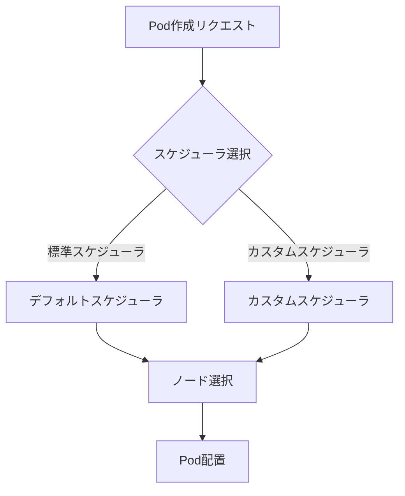
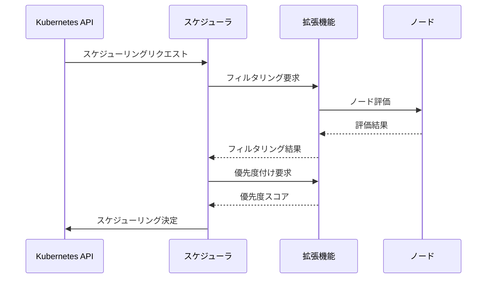

# カスタムスケジューラと拡張機能

## 1. トピックの簡単な説明
カスタムスケジューラと拡張機能は、Kubernetesの標準スケジューラを拡張し、組織固有の要件に合わせた柔軟なスケジューリングを実現するための機能です。

## 2. なぜ必要なのか

### この機能がないとどうなるのか
- 標準のスケジューラでは対応できない特殊な要件に対応できない
- 組織固有のスケジューリングポリシーを実装できない
- カスタムメトリクスに基づくスケジューリングができない

### どのような問題が発生するのか
- 特定のワークロードに最適化されたスケジューリングができない
- 複雑なスケジューリング要件を満たせない
- 組織固有の運用ポリシーを自動化できない

### どのようなメリットがあるのか
- 組織固有の要件に合わせた柔軟なスケジューリングが可能
- カスタムメトリクスに基づくインテリジェントなスケジューリング
- 複数のスケジューラを並行して使用可能
- スケジューリングロジックのカスタマイズと拡張が容易

## 3. 重要なポイントの解説
カスタムスケジューラと拡張機能は、Kubernetesの標準スケジューラでは対応できない特殊な要件や、組織固有のポリシーを実装する際に重要な役割を果たします。これにより、より効率的で柔軟なリソース管理が可能になります。

## 4. 実際の使い方や具体例

### カスタムスケジューラの実装例
```yaml
apiVersion: v1
kind: Pod
metadata:
  name: nginx
spec:
  schedulerName: my-custom-scheduler  # カスタムスケジューラを指定
  containers:
  - name: nginx
    image: nginx
```

### スケジューラ拡張機能の設定例
```yaml
apiVersion: kubescheduler.config.k8s.io/v1
kind: KubeSchedulerConfiguration
extenders:
- urlPrefix: "http://extender-service:80"
  filterVerb: "filter"
  prioritizeVerb: "prioritize"
  weight: 1
  enableHttps: false
```

## 5. 図解による説明

### カスタムスケジューラの基本アーキテクチャ


### スケジューラ拡張機能の動作フロー


## セキュリティ上の注意点
- カスタムスケジューラの実装時は、適切な認証・認可の仕組みを実装する
- 拡張機能のエンドポイントは適切に保護する
- スケジューラのリソース使用量を監視する

## 参考リソース
- [IBM Developer: Create a custom Kubernetes scheduler](https://developer.ibm.com/articles/creating-a-custom-kube-scheduler/)
- [Custom Scheduler Kubernetes | Multiple Schedulers Kubernetes](https://www.youtube.com/watch?v=NiB7sjXmiZc)
