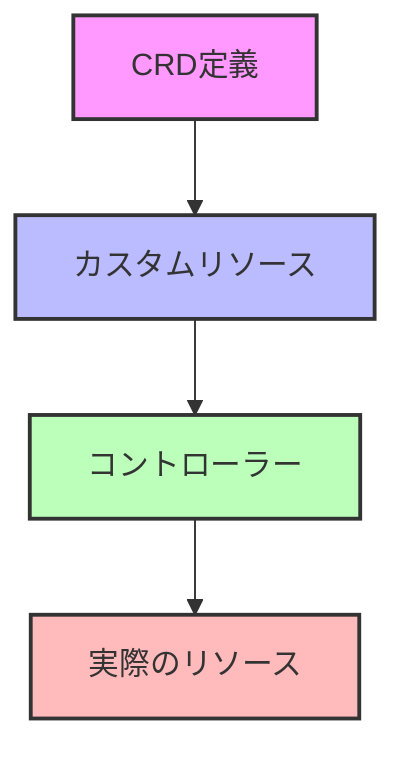
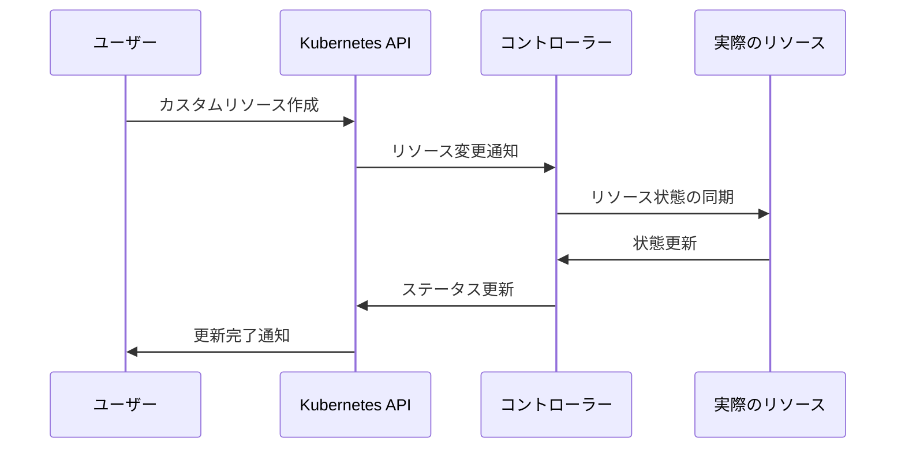

# カスタムリソース定義（CRD）

## 1. トピックの簡単な説明
カスタムリソース定義（CRD）は、KubernetesのAPIを拡張して、組織固有のリソースタイプを定義できる機能です。これにより、Kubernetesのネイティブリソース（Pod、Service等）と同様に、独自のリソースを管理できるようになります。

## 2. なぜ必要なのか

### この機能がないとどうなるのか
- 組織固有のリソースを管理するために、外部システムや独自の管理ツールが必要になる
- リソースの状態管理や操作が複雑化し、一貫性の維持が困難になる
- 運用自動化の実現が難しくなる

### どのような問題が発生するのか
- 複数の管理システムの連携が必要になり、運用コストが増加
- リソースの状態管理が分散し、整合性の維持が困難
- 自動化の実装が複雑になり、エラーのリスクが高まる

### どのようなメリットがあるのか
- Kubernetesの標準的な管理インターフェースで独自リソースを管理可能
- リソースの状態管理が一元化され、運用が簡素化
- コントローラーと組み合わせることで、自動化が容易に実現可能
- 組織固有の要件に合わせた柔軟なリソース定義が可能

## 3. 重要なポイントの解説
CRDは、Kubernetesの拡張性を最大限に活用するための重要な機能です。組織固有のリソースをKubernetesのネイティブリソースと同様に管理できることで、運用の効率化と自動化の実現を可能にします。

## 4. 実際の使い方や具体例

### CRDの定義例
```yaml
apiVersion: apiextensions.k8s.io/v1
kind: CustomResourceDefinition
metadata:
  name: databases.example.com
spec:
  group: example.com
  names:
    kind: Database
    plural: databases
    singular: database
    shortNames:
    - db
  scope: Namespaced
  versions:
    - name: v1
      served: true
      storage: true
      schema:
        openAPIV3Schema:
          type: object
          properties:
            spec:
              type: object
              properties:
                type:
                  type: string
                version:
                  type: string
                replicas:
                  type: integer
```

### カスタムリソースの使用例
```yaml
apiVersion: example.com/v1
kind: Database
metadata:
  name: mysql-db
spec:
  type: mysql
  version: "8.0"
  replicas: 3
```

## 5. 図解による説明

### CRDの基本構造


### CRDの動作フロー


## セキュリティ面での注意点
- CRDの定義時には、適切なバリデーションを設定し、不正な値の入力を防止する
- カスタムリソースへのアクセス制御を適切に設定し、必要な権限のみを付与する
- コントローラーの実装時には、セキュリティベストプラクティスに従う

## 参考情報
- [Kubernetes公式ドキュメント - Custom Resources](https://kubernetes.io/docs/concepts/extend-kubernetes/api-extension/custom-resources/)
- [Kubernetes公式ドキュメント - CustomResourceDefinition](https://kubernetes.io/docs/tasks/extend-kubernetes/custom-resources/custom-resource-definitions/)
