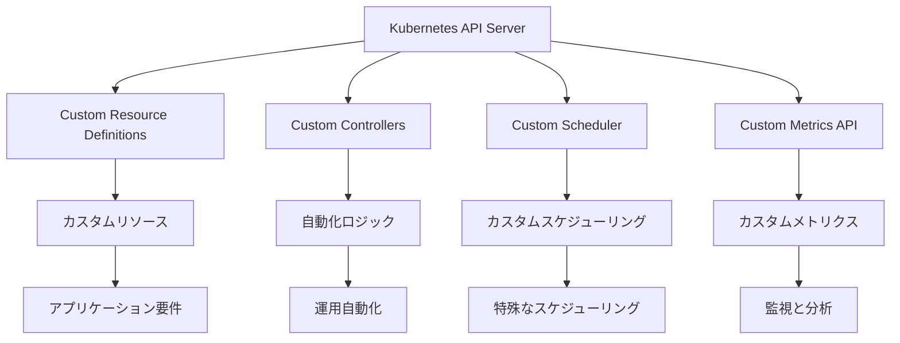
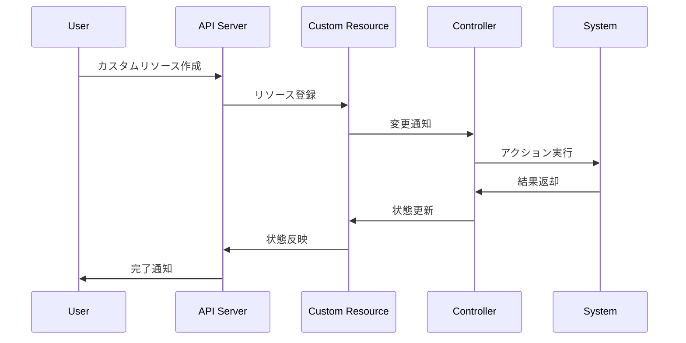

# Kubernetes拡張機能とAPI

## 1. トピックの簡単な説明
Kubernetes拡張機能とAPIは、Kubernetesの動作をカスタマイズし、システムに新しい機能を追加するための仕組みです。これにより、標準のKubernetes機能を拡張して、より柔軟で強力なシステムを構築することができます。

## 2. なぜ必要なのか

### この機能がないとどうなるのか
- 標準のKubernetes機能だけでは、特定のユースケースに対応できない
- カスタムの要件や特殊なワークロードに対応できない
- 組織固有の運用ルールやポリシーを強制できない

### どのような問題が発生するのか
- 複雑な運用プロセスを自動化できない
- 独自のリソース管理や監視が困難
- 組織固有のセキュリティ要件を満たせない
- 標準機能では実現できない特殊なスケジューリング要件に対応できない

### どのようなメリットがあるのか
- 組織固有の要件に合わせたカスタマイズが可能
- 運用の自動化と効率化
- セキュリティとコンプライアンスの強化
- 新しい機能の追加が容易
- 既存のKubernetesエコシステムとの統合

## 3. 重要なポイントの解説
Kubernetes拡張機能とAPIは、クラウドネイティブアプリケーションの運用を効率化し、組織固有の要件に対応するために不可欠です。特に、大規模なシステムや特殊な要件を持つ環境では、標準機能だけでは不十分な場合が多く、拡張機能を活用することで柔軟な対応が可能になります。

## 4. 実際の使い方や具体例

### Custom Resource Definition (CRD)の例
```yaml
apiVersion: apiextensions.k8s.io/v1
kind: CustomResourceDefinition
metadata:
  name: databases.example.com
spec:
  group: example.com
  names:
    kind: Database
    plural: databases
    singular: database
    shortNames:
    - db
  scope: Namespaced
  versions:
    - name: v1
      served: true
      storage: true
      schema:
        openAPIV3Schema:
          type: object
          properties:
            spec:
              type: object
              properties:
                type:
                  type: string
                version:
                  type: string
```

### Custom Controllerの例
```go
func (c *DatabaseController) Reconcile(ctx context.Context, req ctrl.Request) (ctrl.Result, error) {
    var database examplev1.Database
    if err := c.Get(ctx, req.NamespacedName, &database); err != nil {
        return ctrl.Result{}, client.IgnoreNotFound(err)
    }
    
    // データベースの作成・更新ロジック
    return ctrl.Result{}, nil
}
```

## 5. 図解による説明

### Kubernetes拡張機能の全体像


### 拡張機能の実装フロー


## セキュリティ上の注意点
- カスタムコントローラーの実装時は、適切な認証・認可の仕組みを実装する
- カスタムリソースのスキーマ定義は慎重に行い、セキュリティホールを作らない
- カスタムメトリクスAPIの実装時は、機密情報の漏洩に注意する
- 拡張機能の実装は、最小権限の原則に従う

## 参考リンク
- [Kubernetes Extensions Documentation](https://kubernetes.io/docs/concepts/extend-kubernetes/#extensions)
- [Kubernetes API Overview](https://kubernetes.io/docs/concepts/overview/kubernetes-api/)
