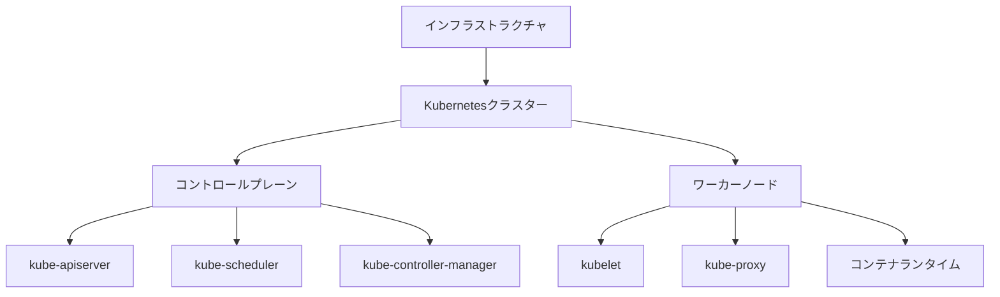
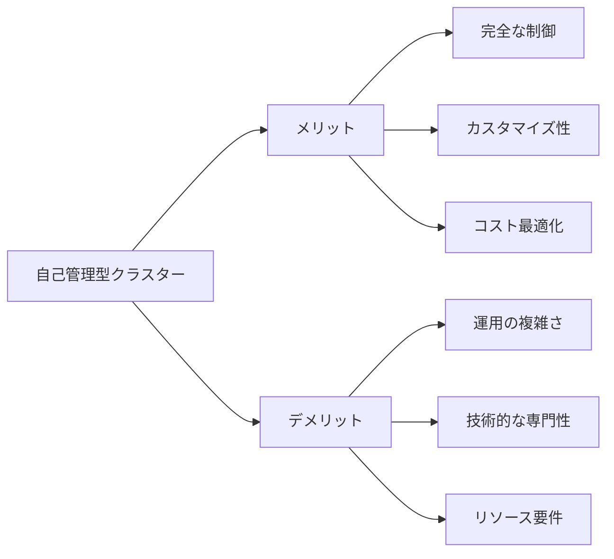

# 自分でKubernetesクラスターを管理すべきか

## 1. トピックの簡単な説明
Kubernetesクラスターの自己管理とは、クラウドプロバイダーに依存せず、自社のインフラストラクチャ上でKubernetesクラスターを構築・運用する方法です。

## 2. なぜ必要なのか

### この機能がないとどうなるのか
- クラウドプロバイダーに依存した運用となり、ベンダーロックインのリスクが高まります
- インフラストラクチャの詳細な制御が制限される可能性があります
- コスト最適化の柔軟性が低下します

### どのような問題が発生するのか
- クラウドプロバイダーの障害に影響を受けやすくなります
- カスタマイズの自由度が制限される場合があります
- 長期的なコストが予測しづらくなります

### どのようなメリットがあるのか
- インフラストラクチャの完全な制御が可能になります
- セキュリティ要件に合わせた細かい設定が可能です
- コスト最適化の柔軟性が高まります
- ベンダーロックインを避けることができます

## 3. 重要なポイントの解説
自己管理型クラスターは、完全な制御とカスタマイズ性を求める組織に適していますが、運用の複雑さと責任が増加します。適切な判断には、組織の規模、技術的な専門性、リソースの可用性を考慮する必要があります。

## 4. 実際の使い方や具体例

### クラスター構築の基本ステップ
1. インフラストラクチャの準備
   - 物理サーバーまたは仮想マシンの準備
   - ネットワーク設定
   - ストレージの設定

2. Kubernetesのインストール
   ```bash
   # kubeadmのインストール
   apt-get update && apt-get install -y apt-transport-https ca-certificates curl
   curl -fsSL https://packages.cloud.google.com/apt/doc/apt-key.gpg | apt-key add -
   echo "deb https://apt.kubernetes.io/ kubernetes-xenial main" > /etc/apt/sources.list.d/kubernetes.list
   apt-get update
   apt-get install -y kubelet kubeadm kubectl
   ```

3. クラスターの初期化
   ```bash
   kubeadm init --pod-network-cidr=10.244.0.0/16
   ```

4. ネットワークプラグインのインストール
   ```bash
   kubectl apply -f https://raw.githubusercontent.com/coreos/flannel/master/Documentation/kube-flannel.yml
   ```

## 5. 図解による説明





## セキュリティ面での注意点
- 定期的なセキュリティアップデートの適用
- 適切なアクセス制御の設定
- ネットワークポリシーの実装
- シークレット管理の徹底
- 監査ログの有効化と定期的な確認

## 参考リソース
- [公式ドキュメント: kubeadmを使用したクラスターの作成](https://kubernetes.io/docs/setup/production-environment/tools/kubeadm/create-cluster-kubeadm/)
- [Kubernetesクラスターのインストールチュートリアル](https://www.youtube.com/watch?v=Ro2qeYeisZQ)
