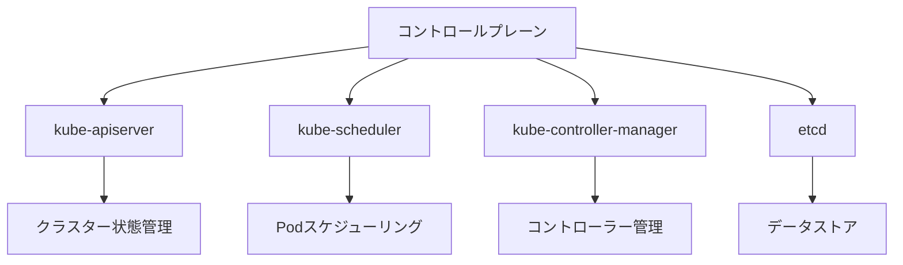
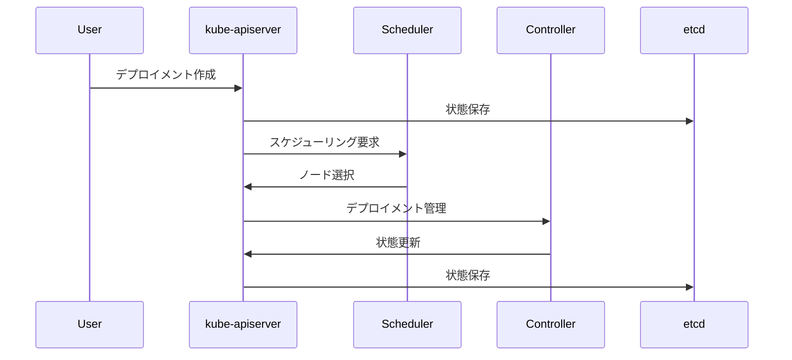

# Kubernetesコントロールプレーンのインストール

## 1. トピックの簡単な説明
Kubernetesコントロールプレーンは、クラスター全体の管理と制御を担当する重要なコンポーネント群です。クラスターの状態管理、スケジューリング、イベント検知など、クラスターの「頭脳」として機能します。

## 2. なぜ必要なのか

### この機能がないとどうなるのか
- クラスター全体の管理が不可能になります
- コンテナのスケジューリングが機能しなくなります
- クラスターの状態管理ができなくなります

### どのような問題が発生するのか
- アプリケーションのデプロイが制御できなくなります
- クラスターの状態監視ができなくなります
- 障害発生時の自動復旧が機能しなくなります

### どのようなメリットがあるのか
- クラスター全体の一元管理が可能になります
- 自動的なスケーリングと自己修復機能が提供されます
- クラスターの状態を常に監視・管理できます

## 3. 重要なポイントの解説
コントロールプレーンは、Kubernetesクラスターの「司令塔」として機能し、クラスター全体の健全性と可用性を確保します。適切なインストールと設定は、安定したクラスター運用の基盤となります。

## 4. 実際の使い方や具体例

### 基本的なインストール手順
```bash
# kubeadmのインストール
apt-get update && apt-get install -y apt-transport-https ca-certificates curl
curl -fsSL https://packages.cloud.google.com/apt/doc/apt-key.gpg | gpg --dearmor -o /etc/apt/keyrings/kubernetes-apt-keyring.gpg
echo "deb [signed-by=/etc/apt/keyrings/kubernetes-apt-keyring.gpg] https://apt.kubernetes.io/ kubernetes-xenial main" | tee /etc/apt/sources.list.d/kubernetes.list
apt-get update
apt-get install -y kubelet kubeadm kubectl

# コントロールプレーンの初期化
kubeadm init --pod-network-cidr=10.244.0.0/16
```

### 重要な設定パラメータ
- `--pod-network-cidr`: PodネットワークのCIDR範囲
- `--apiserver-advertise-address`: APIサーバーのアドレス
- `--control-plane-endpoint`: コントロールプレーンのエンドポイント

## 5. 図解による説明

### コントロールプレーンの構成


### コントロールプレーンの役割


## セキュリティ上の注意点
- コントロールプレーンノードへのアクセスは厳密に制限する
- 適切なRBAC設定を行う
- 定期的な証明書のローテーションを実施する
- ネットワークポリシーでアクセスを制限する

## 参考リソース
- [Kubernetes公式ドキュメント - コントロールプレーンの初期化](https://kubernetes.io/docs/setup/production-environment/tools/kubeadm/create-cluster-kubeadm/#initializing-your-control-plane-node)
- [Kubernetes公式ドキュメント - クラスター管理](https://kubernetes.io/docs/concepts/overview/components/)
