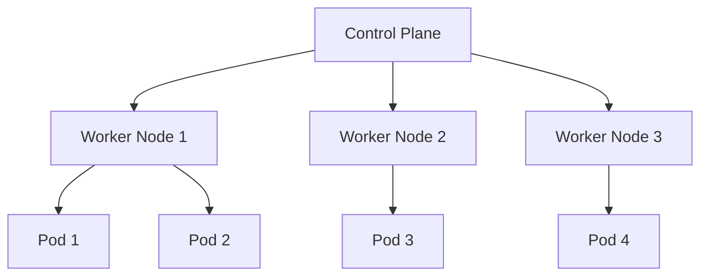
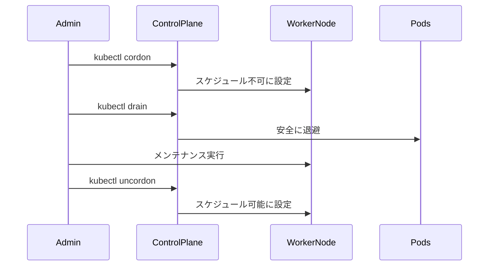

# ワーカーノードの追加と管理

## 1. トピックの簡単な説明
ワーカーノードは、Kubernetesクラスター内で実際にコンテナを実行する物理マシンまたは仮想マシンです。アプリケーションのワークロードを実行するための重要なコンポーネントです。

## 2. なぜ必要なのか

### この機能がないとどうなるのか
- アプリケーションを実行する場所がなくなる
- スケーラビリティが確保できない
- 高可用性を実現できない

### どのような問題が発生するのか
- リソース不足によるパフォーマンス低下
- 単一障害点の発生
- ワークロードの分散ができない

### どのようなメリットがあるのか
- 水平スケーリングによる柔軟なリソース管理
- 高可用性の実現
- ワークロードの効率的な分散
- メンテナンス時の影響を最小限に抑制

## 3. 重要なポイントの解説
ワーカーノードの適切な管理は、クラスターの安定性とパフォーマンスに直結します。ノードの追加・削除・メンテナンスを安全に行うことで、アプリケーションの可用性を確保し、リソースを効率的に活用できます。

## 4. 実際の使い方や具体例

### ノードの追加
```bash
# ノードの状態確認
kubectl get nodes

# ノードの詳細情報確認
kubectl describe node <node-name>

# ノードへのラベル付け
kubectl label nodes <node-name> key=value
```

### ノードのメンテナンス
```bash
# ノードをスケジュール不可に設定（メンテナンス前）
kubectl cordon <node-name>

# ノード上のPodを安全に退避
kubectl drain <node-name> --ignore-daemonsets

# メンテナンス後のノードを再度有効化
kubectl uncordon <node-name>
```

## 5. 図解による説明

### ノードの基本構成


### ノードのメンテナンスフロー


## セキュリティ上の注意点
- ノードへのアクセス制御を適切に設定
- ノードの認証情報を安全に管理
- 定期的なセキュリティアップデートの実施
- ノードの監視とログ収集の設定

## 参考リソース
- [Kubernetes公式ドキュメント: ノード管理](https://kubernetes.io/docs/concepts/architecture/nodes/#management)
- [Kubernetes 101: Nodes Tutorial](https://www.youtube.com/watch?v=xhwi3zIVR-8)
