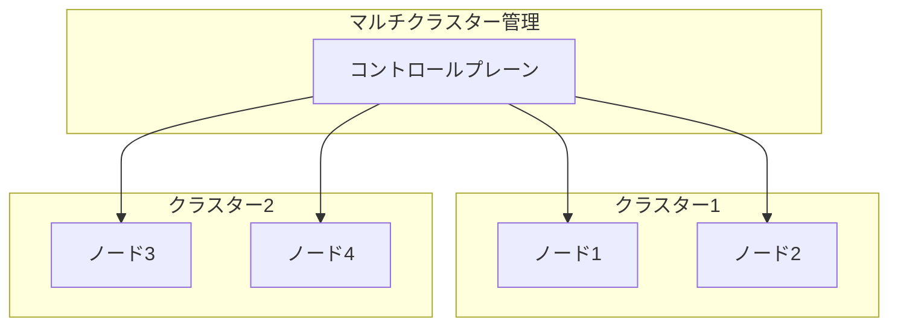
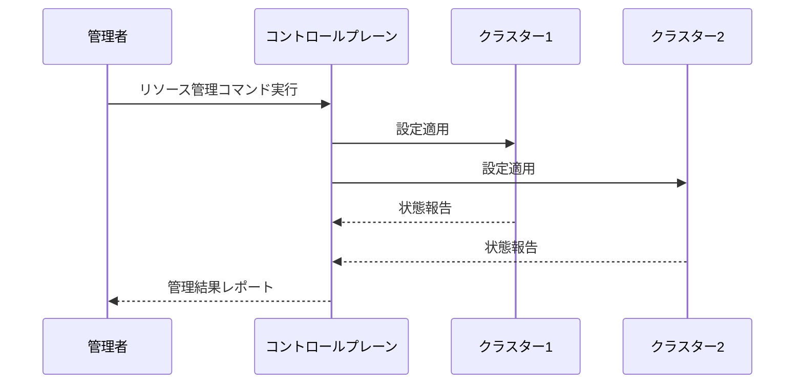

# マルチクラスター管理

## 1. トピックの簡単な説明
マルチクラスター管理とは、複数のKubernetesクラスターを単一のコントロールプレーンから一元管理する仕組みです。異なる環境（開発、本番、リージョンなど）に分散した複数のクラスターを効率的に管理・運用することができます。

## 2. なぜ必要なのか

### この機能がないとどうなるのか
- 各クラスターごとに個別の管理が必要になり、運用コストが増大
- クラスター間の設定やポリシーの一貫性を保つのが困難
- リソースの効率的な配分や監視が複雑化

### どのような問題が発生するのか
- クラスターごとに異なる設定やバージョンが混在
- セキュリティポリシーの適用漏れや不整合
- 運用作業の重複や人的ミスのリスク増加
- クラスター間のリソース最適化が困難

### どのようなメリットがあるのか
- 一元管理による運用効率の向上
- クラスター間の一貫性確保
- セキュリティポリシーの統一的な適用
- リソースの効率的な配分と最適化
- 障害時の迅速な対応と復旧

## 3. 重要なポイントの解説
マルチクラスター管理は、大規模なKubernetes環境を効率的に運用するために不可欠な機能です。特に、複数の環境（開発・テスト・本番）や複数のリージョンにまたがるシステムを運用する場合、クラスター間の一貫性を保ちながら、効率的なリソース管理を実現することができます。

## 4. 実際の使い方や具体例

### kubeconfigの設定例
```yaml
apiVersion: v1
kind: Config
clusters:
- cluster:
    certificate-authority: /path/to/ca.crt
    server: https://cluster1.example.com:6443
  name: cluster1
- cluster:
    certificate-authority: /path/to/ca.crt
    server: https://cluster2.example.com:6443
  name: cluster2
contexts:
- context:
    cluster: cluster1
    user: admin
  name: cluster1-admin
- context:
    cluster: cluster2
    user: admin
  name: cluster2-admin
current-context: cluster1-admin
users:
- name: admin
  user:
    client-certificate: /path/to/client.crt
    client-key: /path/to/client.key
```

### クラスター切り替えの例
```bash
# クラスター1に切り替え
kubectl config use-context cluster1-admin

# クラスター2に切り替え
kubectl config use-context cluster2-admin
```

## 5. 図解による説明

### マルチクラスター管理の基本構成


### クラスター間のリソース管理フロー


## セキュリティ上の注意点
- クラスター間の通信は必ずTLSで暗号化
- 適切なRBACポリシーの設定
- クラスターごとのアクセス制御の実装
- 定期的な証明書の更新と管理

## 参考リンク
- [Kubernetes公式ドキュメント - マルチクラスターアクセスの設定](https://kubernetes.io/docs/tasks/access-application-cluster/configure-access-multiple-clusters/)
- [Kubernetes Cluster Management Strategies](https://www.youtube.com/watch?v=966TJ6mlOYY)
