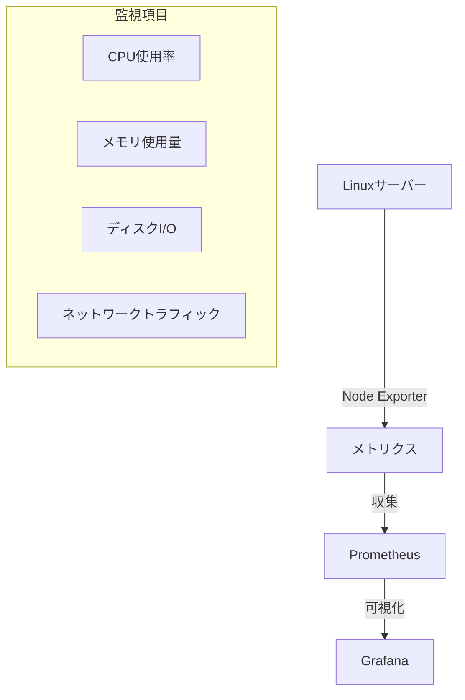
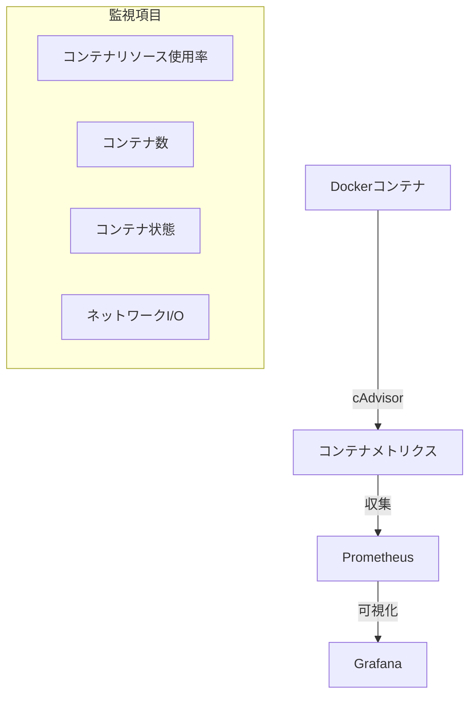
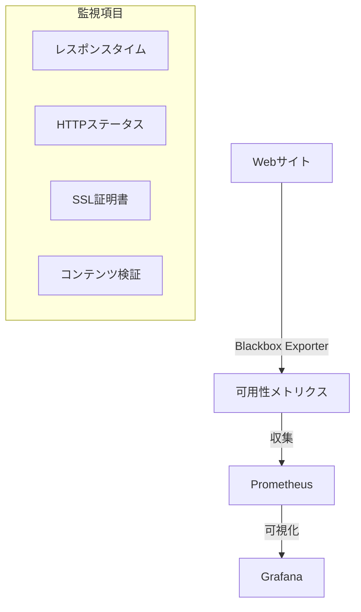

# PrometheusとGrafanaの監視対象

## 概要
PrometheusとGrafanaは、様々なインフラストラクチャやアプリケーションの監視に活用できます。主要な監視対象とその特徴について説明します。

## 主要な監視対象

### Linuxサーバー監視

主な監視項目：
- システムリソース（CPU、メモリ、ディスク）
- プロセス情報
- ネットワーク統計
- ファイルシステムの状態

### Dockerコンテナ監視

主な監視項目：
- コンテナのリソース使用状況
- コンテナの起動/停止状態
- コンテナ間のネットワーク通信
- コンテナのログ情報

### Webサイト監視

主な監視項目：
- サイトの可用性
- レスポンスタイム
- HTTPステータスコード
- SSL証明書の有効期限

## 監視のベストプラクティス
- 監視対象に応じた適切なExporterの選択
- アラート閾値の適切な設定
- メトリクスの保持期間の最適化
- ダッシュボードの整理と分類

## セキュリティ考慮事項
- Exporterのアクセス制御
- センシティブなメトリクスデータの保護
- 監視対象への負荷考慮

## 参考資料
- [Node Exporter](https://github.com/prometheus/node_exporter)
- [cAdvisor](https://github.com/google/cadvisor)
- [Blackbox Exporter](https://github.com/prometheus/blackbox_exporter) 
