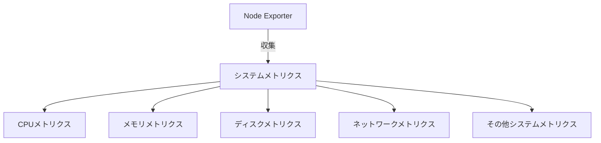

# Node Exporter入門

## 概要
Node Exporterは、Linux/UnixシステムのハードウェアとOSのメトリクスを収集するためのPrometheusの公式Exporterです。システムの状態を包括的に監視するための基本的なツールとして広く利用されています。

## 主な機能


## 収集する主要メトリクス

### CPU関連
- `node_cpu_seconds_total`: CPU時間の使用状況
- `node_cpu_frequency_hertz`: CPU周波数
- `node_cpu_temperature_celsius`: CPU温度（対応ハードウェアの場合）

### メモリ関連
- `node_memory_MemTotal_bytes`: 総メモリ容量
- `node_memory_MemFree_bytes`: 空きメモリ容量
- `node_memory_Buffers_bytes`: バッファメモリ
- `node_memory_Cached_bytes`: キャッシュメモリ

### ディスク関連
- `node_filesystem_size_bytes`: ファイルシステムの総容量
- `node_filesystem_free_bytes`: ファイルシステムの空き容量
- `node_disk_read_bytes_total`: ディスク読み取りバイト数
- `node_disk_written_bytes_total`: ディスク書き込みバイト数

### ネットワーク関連
- `node_network_receive_bytes_total`: 受信バイト数
- `node_network_transmit_bytes_total`: 送信バイト数
- `node_network_up`: ネットワークインターフェースの状態

## インストールと設定

### 基本的なインストール手順
```bash
# バイナリのダウンロード
wget https://github.com/prometheus/node_exporter/releases/download/v1.7.0/node_exporter-1.7.0.linux-amd64.tar.gz

# 解凍
tar xvfz node_exporter-1.7.0.linux-amd64.tar.gz

# 実行
./node_exporter
```

### システムサービスとしての設定
```ini
[Unit]
Description=Node Exporter
After=network-online.target

[Service]
User=node_exporter
Group=node_exporter
Type=simple
ExecStart=/usr/local/bin/node_exporter

[Install]
WantedBy=multi-user.target
```

## セキュリティ考慮事項
- デフォルトでは9100ポートでHTTPエンドポイントを公開
- 必要に応じて認証の設定を検討
- ファイアウォールでのアクセス制限
- センシティブなシステム情報の取り扱いに注意

## ベストプラクティス
- 定期的なバージョンアップデート
- メトリクスの保持期間の最適化
- アラート閾値の適切な設定
- 監視対象の重要度に応じた収集間隔の調整

## トラブルシューティング
- メトリクスが収集できない場合の確認ポイント
  - Node Exporterプロセスの状態
  - ポートの開放状態
  - ファイアウォールの設定
  - システムリソースの使用状況

## 参考資料
- [Node Exporter公式ドキュメント](https://github.com/prometheus/node_exporter)
- [Prometheus公式ドキュメント](https://prometheus.io/docs/guides/node-exporter/) 
