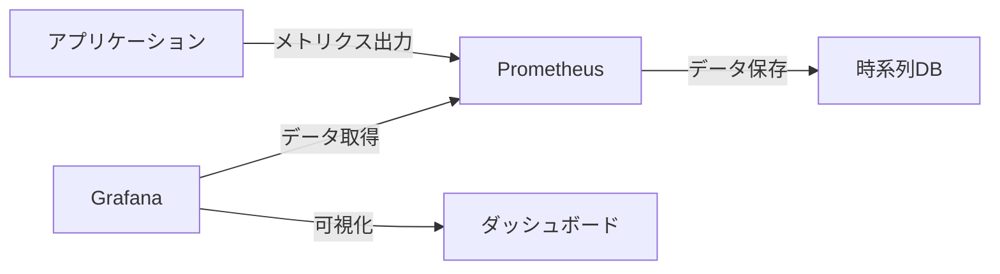

# PrometheusとGrafana入門

## 概要
PrometheusとGrafanaは、現代のクラウドネイティブ環境において不可欠な監視・可視化ツールです。Prometheusは時系列データベースとしてメトリクスを収集・保存し、Grafanaはそのデータを美しいダッシュボードで可視化します。

## 主要概念
Prometheusは、プル型アーキテクチャを採用したオープンソースの監視システムで、HTTPエンドポイントから定期的にメトリクスを収集します。一方、Grafanaは、Prometheusを含む様々なデータソースからデータを取得し、インタラクティブなダッシュボードを作成できる可視化プラットフォームです。

## 基本的なアーキテクチャ

## 主な特徴
- **Prometheus**
  - プル型アーキテクチャ
  - 多次元データモデル
  - 強力なクエリ言語（PromQL）
  - アラート機能

- **Grafana**
  - 豊富なデータソース対応
  - カスタマイズ可能なダッシュボード
  - アラート通知機能
  - チーム共有機能

## セキュリティ考慮事項
- PrometheusとGrafanaの通信は、可能な限りTLSで暗号化
- 適切なアクセス制御と認証の設定
- センシティブなメトリクスデータの取り扱いに注意

## 参考資料
- [Prometheus公式ドキュメント](https://prometheus.io/docs/)
- [Grafana公式ドキュメント](https://grafana.com/docs/) 
